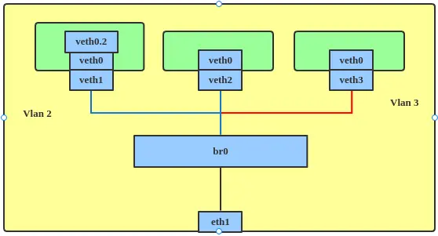

# Linux KVM 

KVM consists of a loadable kernel module, kvm.ko, that provides the core virtualization infrastructure and a processor specific module, kvm-intel.ko or kvm-amd.ko. Below diagram illustrates how the KVM hypervisor virtualizes the compute resources for Linux on KVM.

**Installation**
- Step1:  Verification
```
cat /proc/cpuinfo | egrep --color "vmx|svm"
lscpu | grep Virtualization
```

- Step2: Install libvirt on Centos 9
Run Command:
```
sudo dnf groupinstall "Virtualization Host" -y
sudo dnf install epel-release yum-utils -y
sudo dnf install -y qemu-kvm libvirt ibvirt-devel libvirt-client virt-install virt-viewer
sudo dnf install -y libguestfs-tools libguestfs-xfs virt-top
sudo dnf install -y bridge-utils   
sudo dnf install  libvirt-python virt-manager  
```

- Step3: Start libvirt
```
sudo systemctl start libvirtd
sudo systemctl status libvirt
```

- Step4: Check if kernel modules are loaded
```
$ lsmod | grep kvm

kvm_intel             446464  0
kvm                  1392640  1 kvm_intel
irqbypass              12288  1 kvm

```

## Linux Bridge
The Linux bridge ``virbr0`` is created at the time of installation and can be used to create Virtual Machines that doesn’t need external IP connectivity. It uses NAT to give VMs internet access.

A Linux bridge is a kernel module that behaves like a network switch, forwarding packets between interfaces that are connected to it. It's usually used for forwarding packets on routers, on gateways, or between VMs and network namespaces on a host.



```
$ ip a
$ ip link show
$ brctl show
```