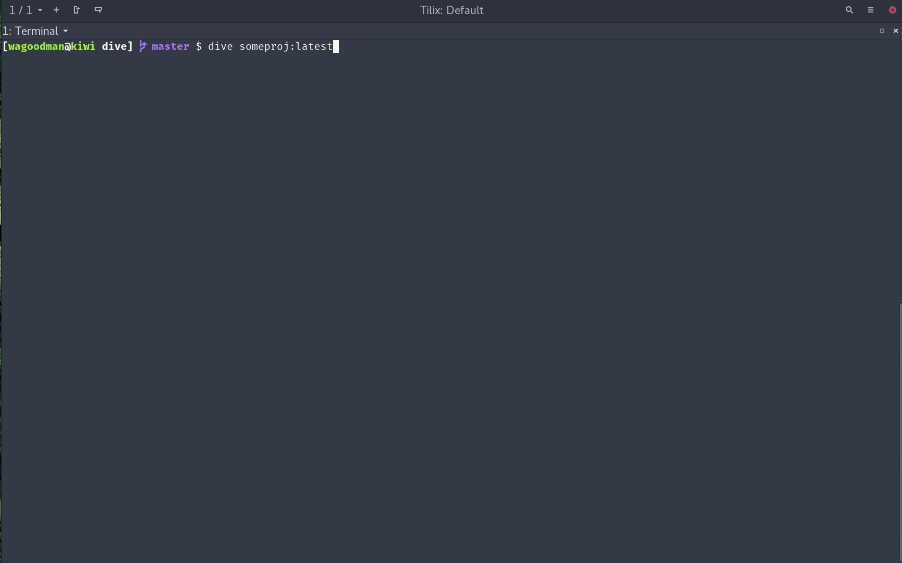

# install dive

Container technology is a method of operating system virtualization that allows you to run an application and its dependencies in a resource-isolated process. Containers bundle an application's code, libraries, and configuration files into a single package, ensuring that it runs consistently across different computing environments.

This technology has become increasingly popular in modern software development due to its efficiency and portability. Let's delve deeper into the core concepts of container technology.

### Core Components

At the heart of container technology are three key components:

* **Container Image:** This is a lightweight, standalone, and executable package that includes everything needed to run a piece of software, including the code, a runtime, libraries, environment variables, and configuration files. Images are often built in layers, with each layer representing a change to the image.

* **Container:** A container is a running instance of a container image. It is an isolated environment where the application can run without interfering with other applications or the underlying system. You can create, start, stop, move, and delete containers.

* **Container Runtime:** This is the software that is responsible for managing the lifecycle of containers. It pulls the container image from a repository and uses the underlying operating system's features to create and run the container. Popular container runtimes include Docker, containerd, and CRI-O.

---
## How Container Technology Works

Containerization works by leveraging features of the host operating system's kernel to isolate processes and manage their access to resources like CPU, memory, and storage. This is different from traditional virtualization, which creates a complete virtual machine with its own operating system.

Because containers share the host OS kernel, they are much more lightweight and faster to start than virtual machines. This efficiency allows you to run multiple containers on a single host, making better use of your hardware resources.

---
## Key Benefits of Container Technology

The adoption of container technology offers several significant advantages for developers and operations teams:

* **Portability:** Containers encapsulate an application and its dependencies, allowing it to run consistently across various environments, from a developer's laptop to a production server in the cloud. This "build once, run anywhere" capability simplifies development and deployment workflows.

* **Efficiency:** Containers have a smaller footprint than virtual machines because they don't require a separate operating system for each application. This leads to faster startup times and more efficient use of system resources.

* **Scalability:** You can quickly and easily create new containers to handle increased load, making it simple to scale your applications up or down as needed. Container orchestration platforms like Kubernetes automate this process.

* **Isolation:** Containers provide a level of isolation between applications. An issue in one container will not affect others running on the same host. This improves the overall stability and security of your applications.

* **Agility:** The lightweight and portable nature of containers enables faster development and deployment cycles. This aligns well with modern software development practices like DevOps and CI/CD (Continuous Integration/Continuous Delivery).

In conclusion, container technology provides a powerful and flexible way to package, distribute, and run applications, making it a cornerstone of modern cloud-native application development.

## Overlayfile system


An **overlay file system** is a type of file system that allows you to superimpose one file system on top of another. 📁 Think of it like placing a transparent sheet over a document. You can write on the transparency, and what you write appears to be part of the original document. However, the original document remains untouched.

This powerful concept is a cornerstone of container technology, particularly Docker, as it allows for efficient and isolated file management.

---
## How It Works: The Transparency Analogy

Imagine you have a read-only base document (the **lower directory**). You then place a transparent sheet (the **upper directory**) on top of it.

* **Reading a file:** When you look at the combined document and transparency, you see the contents of both. If a file exists in both the upper and lower directories, the one on the transparent sheet (upper directory) takes precedence.

* **Writing to a file:** If you write something new, it's written on the transparent sheet (the upper directory). The original document (lower directory) is not modified. This is known as a **copy-on-write** operation.

* **Deleting a file:** If you "erase" something from the original document, you are actually creating a "whiteout" entry on the transparent sheet that hides the file in the lower directory.

---
## Key Components

An overlay file system typically consists of the following directories:

* **`lowerdir`**: This is the read-only base layer. In the context of containers, this is often the container image.

* **`upperdir`**: This is the read-write layer where all changes are made. When a container modifies a file, the change is stored here.

* **`merged`**: This is the unified view of the `lowerdir` and `upperdir`. It's what the user or application actually sees and interacts with.

* **`workdir`**: This is a working directory used by the overlay file system to prepare files before they are moved to the `upperdir`.


---
## Benefits of Overlay File Systems

The use of overlay file systems provides several significant advantages, especially in the world of containers:

* **Efficiency:** Because the base image is read-only and shared among multiple containers, it saves a significant amount of disk space. Changes are only written to the much smaller `upperdir`.

* **Speed:** Creating a new container is incredibly fast because you don't need to make a full copy of the entire file system. You just create a new `upperdir` for the new container.

* **Statelessness:** It's easy to revert to the original state of a container. You can simply discard the `upperdir` and start fresh from the base `lowerdir` image.

In essence, overlay file systems provide a lightweight and efficient way to manage file systems by layering changes on top of a read-only base, which is fundamental to how modern container platforms operate.

## install Tool dive to see docker file layer

!!! note
    Dive: Application for Viewing Contents of docker

[https://github.com/wagoodman/dive](https://github.com/wagoodman/dive)




```bash title="command"
mkdir dive-test
cd dive-test
touch file
```

```bash title="pull debian image"
docker pull debian:latest
```

```
cat <<EOF > Dockerfile
FROM debian:latest

# Set working directory
WORKDIR /app

# Install vim with cleanup in a single RUN layer
RUN apt-get update && \
    apt-get install -y --no-install-recommends vim && \
    apt-get clean && \
    rm -rf /var/lib/apt/lists/*

# Copy the file to the working directory
COPY file .

# Set entrypoint to vim and default to opening the file
ENTRYPOINT ["vim"]
CMD ["file"]
EOF
```

```bash title="command"
# Build the image
docker build -t vim-app .

# Run to edit the default file
docker run -it --rm vim-app

# Run to edit a specific file (path is relative to /app)
docker run -it --rm vim-app myfile.txt

# Run with version check (override CMD)
docker run -it --rm vim-app --version

# Access the container shell to see the file structure
docker run -it --rm vim-app sh -c "ls -la && pwd"
```

```bash title="command"
docker image list
docker inspect <imageid>
dive <imageid>
```