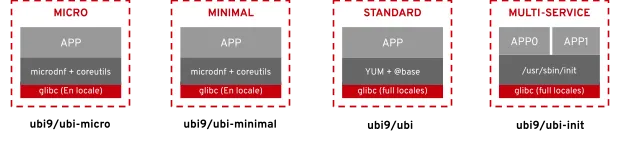

# Docker Docker Compose


## Docker

Docker is a powerful Opensource platform that simplifies the process of developing, packaging, and deploying applications by using containers. It provides an isolated environment, known as a container, where applications can run consistently across different platforms. Containers are isolated from one another and bundle their own software, libraries, and configuration files

## Dockerfile

A Dockerfile is a plain text file that contains instructions for building Docker images. There’s a Dockerfile standard they follow, and the Docker daemon is ultimately responsible for executing the Dockerfile and generating the image.

A typical Dockerfile usually starts by including another image. For example, it might build on a specific operating system or Java distribution.

From there, a Dockerfile can perform various operations to build an image

**Format**

[https://docs.docker.com/reference/dockerfile/](https://docs.docker.com/reference/dockerfile/)
[https://docs.docker.com/build/building/best-practices/](https://docs.docker.com/build/building/best-practices/)
Here is the format of the Dockerfile:

```
# Comment
INSTRUCTION arguments
```

**Example**
```
FROM busybox
ENV FOO=/bar
ARG  CODE_VERSION=latest
WORKDIR ${FOO}   # WORKDIR /bar
ADD . $FOO       # ADD . /bar
COPY \$FOO /quux # COPY $FOO /quux
ENTRYPOINT ["/bin/ping"]
CMD ["localhost"]
```
> The ENTRYPOINT specifies a command that will always be executed when the container starts.
> The CMD specifies arguments that will be fed to the ENTRYPOINT.
> CMD will be overridden when running the container with alternative arguments.


## Docker Compose

Docker Compose is a tool for defining and running multi-container Docker applications. Using a YAML configuration file, Docker Compose allows us to configure multiple containers in one place. We can then start and stop all of those containers at once using a single command.

Additionally, Docker Compose allows us to define common objects shared by containers. For example, we can define a volume once and mount it inside every container, so that they share a common file system. Or, we can define the network used by one or more containers to communicate.

## Docker command

Here are some common Docker commands you might use:

- docker build: Builds a Docker image from a Dockerfile.

- docker run: Runs a command in a new container.

- docker ps: Lists running containers.

- docker stop: Stops one or more running containers.

- docker rm: Removes one or more containers.

- docker images: Lists the Docker images available on your system.

- docker pull: Pulls an image from a registry.

- docker push: Pushes an image to a registry.

>

### Prepare VM

```
mkdir Docker
cd Docker
code Vagrantfile
```
content:
```
# -*- mode: ruby -*-
# vi: set ft=ruby :

Vagrant.configure("2") do |config|

  config.vm.box = "generic/centos9s"
  config.vm.network "forwarded_port", guest: 80, host: 8080
  config.vm.network "private_network", ip: "192.168.33.10"

  # config.vm.network "public_network"

  # config.vm.synced_folder "../data", "/vagrant_data"

  #config.vm.synced_folder ".", "/vagrant"


  config.vm.provider "virtualbox" do |vb|
      vb.memory = "2048"
      vb.cpus = 2
  end

  config.vm.provision "shell", inline: <<-SHELL

  SHELL
end

```

- Run start vagrant
```
vagrant up
vagrant ssh
```

- After Finish class
```
vagrant halt
vagrant destroy
```

### Key understanding
- Docker has a default entrypoint which is /bin/sh -c but does not have a default command.
```
$ docker run -i -t ubuntu bash

// result
root@267a4961b03c:/# exit
```
> - Run image is ubuntu, command is bash
> - Container will gets executed is /bin/sh -c bash

- Run with out bash
```
[vagrant@centos9s lab2]$ docker run -i -t ubuntu
root@6725f7472f23:/#
```
> - Result will we the same result because in Dockerfile of ubuntu CMD is specified
> **CMD ["bash"]**

So Remeber. When using the CMD instruction, it is exactly as if you were executing

>docker run -i -t ubuntu `<cmd>`

The parameter of the entrypoint is `<cmd>`.


[Ubuntu Dockerfile](https://github.com/dockerfile/ubuntu/blob/master/Dockerfile)

By default there's no ENTRYPOINT; whether a shell is used depends on the used form of the CMD
Later on, people asked to be able to customize this, so ENTRYPOINT and --entrypoint were introduced.
so The ENTRYPOINT specifies a command that will always be executed when the container starts.
The CMD specifies arguments that will be fed to the ENTRYPOINT.

### Lab1 ###

```
cd ~
mkdir lab1
cd lab1

cat <<EOF  | tee Dockerfile
FROM ubuntu
# Install ping
RUN apt-get update && apt-get install -y iputils-ping

ENTRYPOINT ["/bin/ping"]
CMD ["localhost"]
EOF

cat Dockerfile
```
- Create image from dockerfile
```
docker build -t lab1 .
```

- list image
```
$ docker images

REPOSITORY   TAG       IMAGE ID       CREATED       SIZE
lab1         latest    6734c52ab144   4 weeks ago   78.1MB
```

- Run
format command ```docker run image-id```
```
$ docker run lab1
PING localhost (::1) 56 data bytes
64 bytes from localhost (::1): icmp_seq=1 ttl=64 time=0.027 ms
64 bytes from localhost (::1): icmp_seq=2 ttl=64 time=0.086 ms
64 bytes from localhost (::1): icmp_seq=3 ttl=64 time=0.089 ms
64 bytes from localhost (::1): icmp_seq=4 ttl=64 time=0.096 ms


#ctrl-c to exit
```
Summary:  ping localhost is default command when run container

```
$ docker run lab1 google.com

PING google.com (142.250.199.14) 56(84) bytes of data.
64 bytes from kul09s14-in-f14.1e100.net (142.250.199.14): icmp_seq=1 ttl=109 time=27.6 ms
64 bytes from kul09s14-in-f14.1e100.net (142.250.199.14): icmp_seq=2 ttl=109 time=27.1 ms
64 bytes from kul09s14-in-f14.1e100.net (142.250.199.14): icmp_seq=3 ttl=109 time=27.7 ms
64 bytes from kul09s14-in-f14.1e100.net (142.250.199.14): icmp_seq=4 ttl=109 time=28.0 ms

#ctrl-c
```
Summary:  google.com will overide CMD arg in container

### remove all Docker containers, you can use the following commands.
- Step1 Stop all running container
```
$ docker stop $(docker ps -q)
```

- Step2 Remove all containers:
After stopping them, you can remove all containers with this command:
```
$ docker rm $(docker ps -a -q)
```

**Explanation:**
- docker ps -q: Lists the IDs of all running containers.
- docker ps -a -q: Lists the IDs of all containers, including stopped ones.
- docker stop $(docker ps -q): Stops all running containers by passing their IDs to the docker stop command.
- docker rm $(docker ps -a -q): Removes all containers by passing their IDs to the docker rm command.

### Lab2 ###



```
cd ~
mkdir lab2
cd lab2

cat <<EOF  | tee Dockerfile
FROM registry.access.redhat.com/ubi9/ubi
RUN  yum update -y && yum install iputils -y
WORKDIR /
CMD ["echo", "Hello Docker"]
EOF

cat Dockerfile
```

```
$ docker images

REPOSITORY   TAG       IMAGE ID       CREATED       SIZE
lab2         latest    8a6e9d1d5a47   8 days ago    213MB
```
- Run
```
$ docker run lab2
$ docker run lab2 ping google.com
```
Summary:   ping google.com will overide cmd

>
>Both CMD and ENTRYPOINT instructions define what command gets executed when running a container. There are few rules >that describe their co-operation.  
>1 Dockerfile should specify at least one of CMD or ENTRYPOINT commands.  
>2 ENTRYPOINT should be defined when using the container as an executable.  
>3 CMD should be used as a way of defining default arguments for an ENTRYPOINT command or for executing an ad-hoc >command in a container.  
>4 CMD will be overridden when running the container with alternative arguments.


## Please remove all running
```
$ docker stop $(docker ps -q)
$ docker rm $(docker ps -a -q)
```

>
### lab3 

```
$ cd ~
$ mkdir redis-server
$ cd redis-server
$ cat <<EOF | tee Dockerfile
FROM ubuntu:24.04

RUN apt-get update && \
    apt-get install -y redis-server && \
    apt-get clean

EXPOSE 6379

CMD ["redis-server", "--protected-mode no"]
EOF

$ cat Dockerfile
```

- Build image
```
$ docker build -t redis-server .
```

- Run image
```
$ docker run -d -p 6379:6379 --name redis redis-server
```

```
$ docker container ls
```
>
## Running Mysql container

- pull mysql image
```
$ docker pull mysql:latest
$ docker images
```

- Run mysql container
```
$ docker run --name test-mysql -e MYSQL_ROOT_PASSWORD=strong_password -d mysql
$ docker ps
```


- run: creates a new container or starts an existing one
- --name CONTAINER_NAME: gives the container a name. The name should be readable and short. In our case, the name is test-mysql.
- -e ENV_VARIABLE=value: the -e tag creates an environment variable that will be accessible within the container. It is crucial to set MYSQL_ROOT_PASSWORD so that we can run SQL commands later from the container. Make sure to store your strong password somewhere safe (not your brain).
- -d: short for detached, the -d tag makes the container run in the background. If you remove this tag, the command will keep printing logs until the container stops.
- image_name: the final argument is the image name the container will be built from. In this case, our image is mysql.


- Access to terminal inside container  ```docker exec -it container_name bash```
```
$ docker exec -it test-mysql bash

// result
bash-5.1#  mysql -u root -p
Enter password: ...
mysql> show databases;
mysql> \q
Bye
bash-5.1# exit
exit
```

- Stop and delete container
```
$ docker stop test-mysql
$ docker rm test-mysql
```

- Start container again with port mapping
```
$ docker run -d --name test-mysql -e MYSQL_ROOT_PASSWORD=strong_password -p 3306:3306 mysql
```

Check port
```
$ docker port test-mysql
3306/tcp -> 0.0.0.0:3306
```

- install mysql client in vagrant
```
$ sudo dnf install mysql
```

- Start connect to mysql at port 3306
```
$ mysql --host=127.0.0.1 --port=3306 -u root -p
Enter password:
```

- Remove 
```
$ docker stop test-mysql; docker rm test-mysql
```

- Configuration mysql container

```
cd ~
mkdir -p test-mysql/config
cd test-mysql
pwd

$ docker run \
   --name test-mysql \
   -v ./test-mysql/config:/etc/mysql/conf.d \
   -e MYSQL_ROOT_PASSWORD=strong_password \
   -d mysql
```
>
- Preserve Data after delete docker container

Persisting data stored in your MySQL containers is crucial for many reasons:

- Data persistence: When you stop or remove a container, all data is lost, including your database. Decoupling the data from the container makes it always accessible.
- Sharing data between containers: Detaching the data from the container allows multiple containers to have access to it. This way, you can avoid data duplication and simplify synchronization between projects that use the same data.
- Portability and backup: persisted data can be easily backed up and shared independently, providing a reliable way to recover from data loss or accidental deletion.
- Improved performance and scalability: By storing frequently accessed data to persistent storage like SSDs, you can improve the performance of your application compared to relying on the container’s writable layer, which is typically slower.

- 1 create volume
```bash
$ docker volume create test-mysql-data
$ docker volume ls

$ docker stop test-mysql; docker rm test-mysql

$ docker run \
   --name test-mysql \
   -v test-mysql-data:/var/lib/mysql \
   -e MYSQL_ROOT_PASSWORD=strong_password \
   -d mysql
```

- 2 inspect volume
```bash
$ docker inspect test-mysql-data
[
    {
        "CreatedAt": "2024-09-05T00:28:33Z",
        "Driver": "local",
        "Labels": null,
        "Mountpoint": "/var/lib/docker/volumes/test-mysql-data/_data",
        "Name": "test-mysql-data",
        "Options": null,
        "Scope": "local"
    }
]

$ ls /var/lib/docker/volumes/test-mysql-data/_data
```

- 3 Clean all
```bash
$ docker stop test-mysql; docker rm test-mysql
$ docker volume rm test-mysql-data
```