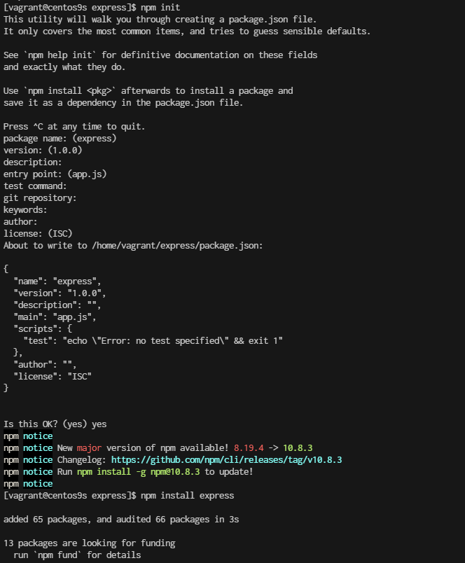
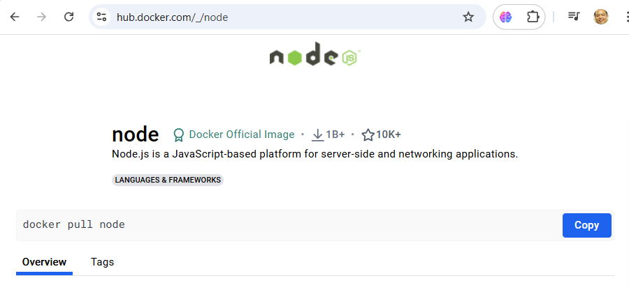

# Express.js project

## Prerequisites

- Create project folder
```bash
cd 
mkdir express
cd express
```

- install node js package
```bash
sudo dnf install nodejs
```

- **Step 1: Setting up the Node.js and Express.js Application**   
Create a simple Node.js and Express.js application. Create a file named app.js and add the following code:

```js
cat <<EOF | tee app.js
const express = require("express");
const app = express();

app.get("/", function(req, res) {
    return res.send("Hello World");
});

app.listen(3000, function(){
    console.log('Listening on port 3000');
});
EOF
```

```bash
$ npm init
$ npm install express

$ node app.js
Listening on port 3000
```

Express server code looks good! Here's a brief rundown of what each part does:

- **Import Express:** const express = require("express"); imports the Express library.

- **Create an Express App:** const app = express(); creates an instance of an Express application.

- **Define a Route:** app.get("/", function(req, res) { return res.send("Hello World"); }); sets up a route for the root URL (/). When someone accesses this URL, the server will respond with "Hello World".

- **Start the Server:** app.listen(3000, function(){ console.log('Listening on port 3000'); }); tells the application to listen on port 3000 and logs a message to the console when the server is running.




- **Step 2: Create a Dockerfile**

```bash
[vagrant@centos9s express]$ ls -l
total 64
-rw-r--r--.  1 vagrant vagrant   211 Sep 12 01:12 app.js
-rw-r--r--.  1 vagrant vagrant   106 Sep 12 01:32 Dockerfile
drwxr-xr-x. 66 vagrant vagrant  4096 Sep 12 01:18 node_modules
-rw-r--r--.  1 vagrant vagrant   251 Sep 12 01:18 package.json
-rw-r--r--.  1 vagrant vagrant 46645 Sep 12 01:18 package-lock.json
```

Next, create a Dockerfile to specify how to build our Docker image. Create a file named Dockerfile in the same directory as your app.js file and add the following content:

[https://hub.docker.com/_/node](https://hub.docker.com/_/node)


- Create Dockerfile
```js
cat <<EOF | tee Dockerfile
FROM node:22-alpine

# Set the working directory in the container
WORKDIR /app

# Copy package.json and package-lock.json if available
COPY package.json package-lock.json ./

# Install dependencies
RUN npm install

# Copy the rest of the application code
COPY . .

# Expose the port that the app runs on
EXPOSE 3000

# Command to run the application
CMD ["node", "app.js"]

EOF
```

- create ```.dockerignore``
Consider adding a .dockerignore file to avoid including unnecessary files in the Docker image:


```bash
cat <<EOF | tee .dockerignore
node_modules
npm-debug.log
Dockerfile
.dockerignore
.git
EOF
```

- **Step 3: Building the Docker Image**
Now that we have our Dockerfile ready, let’s build the Docker image. Open a terminal, navigate to the directory containing your Dockerfile, and run the following command:

```base
$ docker build -t week3_node-application .
```

- **Step 4: Run Docker Container**

```bash
$ docker run -p 3000:3000 week3_node-application
```

- Remove image
```
$ docker stop $(docker ps -a -q)
$ docker rm $(docker pa -a -q)
```

- **Step5 Create Docker Compose**

Docker Compose with your Node.js application, you’ll need to create a docker-compose.yml file. This file allows you to define and run multi-container Docker applications. Since your application is a single container application

```
cat <<EOF | tee docker-compose.yml
version: '3.8'

services:
  app:
    image: my-node-app
    build:
      context: .
      dockerfile: Dockerfile
    ports:
      - "3000:3000"
    volumes:
      - .:/app
    environment:
      NODE_ENV: development
EOF
```

- **services:** This section defines the services (containers) for your application.

    - **app:** This is the name of the service. You can name this whatever you like.

    - **image:** my-node-app: This specifies the Docker image to use. You can either build it yourself or pull it from a repository. In this case, it assumes you will build it using Docker Compose.

    - **build:** This section is used to build the Docker image. context: . indicates the directory where the Dockerfile is located. dockerfile: Dockerfile specifies the name of the Dockerfile (it defaults to Dockerfile if not specified).

    - **ports:** This maps port 3000 on your host machine to port 3000 in the container, allowing you to access the application via http://localhost:3000.

    - **volumes:** This mounts your project directory (.) to /app in the container. This is useful for development as it allows you to see changes in real time without rebuilding the image. For production, you might want to omit this to use the image as-is.

    - **environment:** This sets environment variables for your container. Here, NODE_ENV is set to development.


## Building and Running with Docker Compose
To build and start your application using Docker Compose:

1. Build and Start Services:

```
docker-compose up --build
```
This command builds the Docker image (if not already built) and starts the container as specified in your docker-compose.yml.

2. Stop Services:

```
docker-compose down
```

This command stops and removes the containers defined in your docker-compose.yml file.