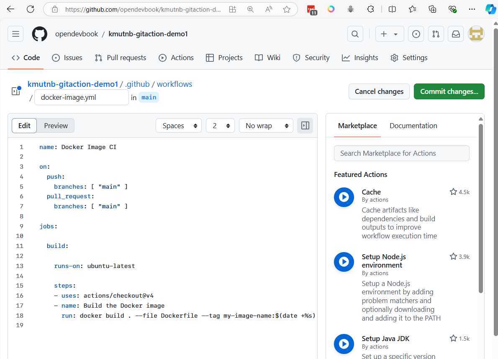
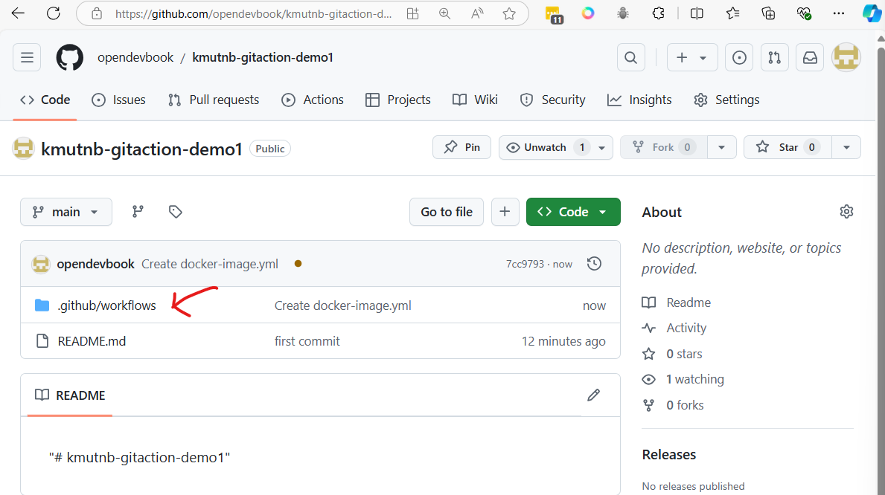
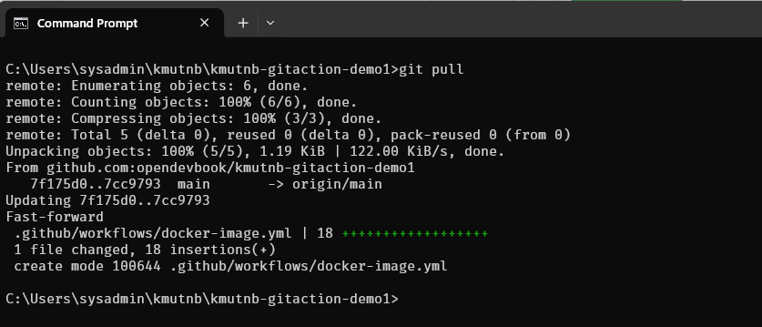
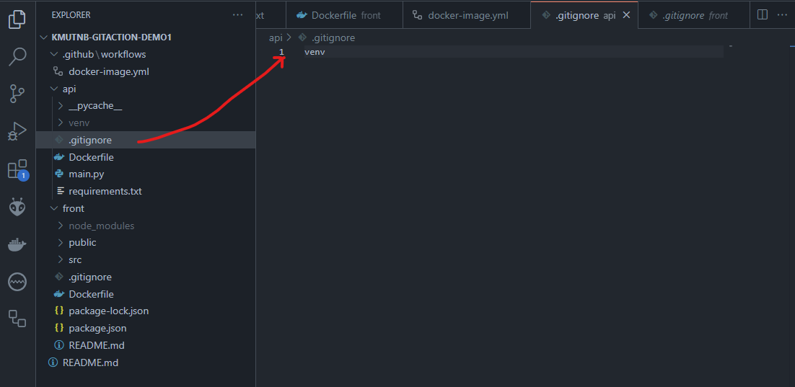

# workshop 1

## Step1 Create github project
- Create project in Github name ```kmutnb-gitaction-demo1```


on local machine
```
mkdir kmutnb-gitaction-demo1
cd kmutnb-gitaction-demo1
echo "# kmutnb-gitaction-demo1" >> README.md
git init
git add README.md
git commit -m "first commit"
git branch -M main
git remote add origin git@github.com:<github-account>/kmutnb-gitaction-demo1.git
git push -u origin main
```

- change github-account to your's accout first
- After push code. Go to Github project and click "Actions" menu


**Search docker in Github Actions template's**
- Click Configure


**commit change to add workflows to projects**

- github actions will add  file ```docker-image.yml``` in folder ```.github/workflows```




**Git pull change to local repo**
```
git pull
```


## Step 2 Explain Git Actions Template to your application
```
name: Docker Image CI

on:
  push:
    branches: [ "main" ]
  pull_request:
    branches: [ "main" ]

jobs:
  build:
    runs-on: ubuntu-latest

    steps:
    - uses: actions/checkout@v4
    - name: Build the Docker images
      run: |
        docker build ./api/ -t ${{ secrets.DOCKER_HUB_ACCOUNT }}/app1-api:latest
        docker build ./front/ -t ${{ secrets.DOCKER_HUB_ACCOUNT }}/app1-frontend:latest

    - name: Login to Docker Hub
      run: |
        echo "${{ secrets.DOCKER_HUB_PASSWORD }}" | docker login -u ${{ secrets.DOCKER_HUB_ACCOUNT }} --password-stdin

    - name: Push images to Docker Hub
      run: |
        docker push ${{ secrets.DOCKER_HUB_ACCOUNT }}/app1-api:latest
        docker push ${{ secrets.DOCKER_HUB_ACCOUNT }}/app1-frontend:latest

```

Ensure that both DOCKER_HUB_ACCOUNT and DOCKER_HUB_PASSWORD are set in your GitHub repository secrets for this workflow to work properly.
- Setting > Secrets and variable > Action > Repository Secret


- final result


GitHub provides two types of secrets: Environment secrets and Repository secrets, and they are used to securely store sensitive information such as API keys, tokens, or passwords. Here's the difference between the two:

**1. Repository Secrets:**
- Scope: Repository-level secrets are accessible to all workflows within the specific repository where they are defined.
- Usage: If you define a secret at the repository level, it can be used across all workflows and jobs in that repository, regardless of which environment (production, staging, etc.) the job runs in.
- Common Use: These secrets are often used when you have workflows that apply across the entire repository, such as Continuous Integration (CI), where you might push Docker images or deploy code.
**Example:**

- Docker Hub credentials (DOCKER_HUB_ACCOUNT, DOCKER_HUB_PASSWORD) used for pushing containers from any branch of the repository.

**2. Environment Secrets:**
- Scope: Environment-level secrets are scoped to specific environments within a repository (e.g., "production," "staging," "development"). You can define different sets of secrets for each environment.
- Usage: Environment secrets are tied to specific deployment or operational environments. A job that uses a specific environment will have access only to the secrets defined for that environment.
- Common Use: These are useful when you have different secrets for different environments (like separate API keys for production and staging). Workflows can specify which environment they run in, and only the secrets for that environment will be accessible.
**Example:**

- Production API key for deployments running in the "production" environment, and a separate staging key for the "staging" environment.
**When to use each:**
- **Repository Secrets** are ideal for secrets that apply globally to all workflows and environments in the repository, such as shared access tokens or service credentials.
- **Environment Secrets** are suitable when your workflows target different environments (e.g., production vs. staging), and you need to manage separate credentials for each environment.

**Key Point:** Environment secrets provide finer control and are more specific, making them useful in scenarios where environment-specific configuration is important.

## Step3 Create Dockerfile in /api

- Create Dockerfile in /api
```
# Use the official Python image from the DockerHub
FROM python:3.11-slim

# Set the working directory in the container
WORKDIR /app

# Copy the requirements file into the container
COPY requirements.txt .

# Install the Python dependencies
RUN pip install --no-cache-dir -r requirements.txt

# Copy the entire FastAPI app into the working directory
COPY . .

# Expose port 8000 to the outside world (FastAPI runs on 8000 by default)
EXPOSE 8000

# Command to run the FastAPI application using Uvicorn
CMD ["uvicorn", "main:app", "--host", "0.0.0.0", "--port", "8000"]
```

create main.py
```
from fastapi import FastAPI

# Create the FastAPI app instance
app = FastAPI()

# Define a root endpoint that returns a simple message
@app.get("/")
def read_root():
    return {"message": "Hello, World!"}

# Define a GET endpoint with a path parameter
# GET /items/5?q=test
@app.get("/items/{item_id}")
def read_item(item_id: int, q: str = None):
    return {"item_id": item_id, "q": q}

# Define a POST endpoint that accepts data in JSON format
# POST /create-item
@app.post("/create-item")
def create_item(item: dict):
    return {"message": "Item created", "item": item}

# Define a PUT endpoint for updating an item
@app.put("/update-item/{item_id}")
def update_item(item_id: int, item: dict):
    return {"message": "Item updated", "item_id": item_id, "updated_data": item}
```

To run the Fast API. We need to use ASGI server like uvicorn
- change directory to api folder
- Create virtual environment 
```
cd api
python -m venv venv
```
- Activate virtual environment
    - On windows
    ```
    venv\Scripts\activate
    ```
    - On mac or linux
    ```
    source venv/bin/activate
    ```

- install python package with pip command
  ```
  pip install fastapi uvicorn
  ```


Run FastApi 
```
uvicorn main:app --reload
```


#### Test Fast Api with postman
[https://www.postman.com/](https://www.postman.com/)


- **test1 GET /**


- **test2 GET /items/5?q=test**


- **test3 POST Endpoint (POST /create-item):**
    - Request Body
    ```
    {
        "name": "Item A",
        "price": 25
    }
    ```


#### To Generate requirements.txt
This will capture the current environment's installed packages and their versions and save them to requirements.txt.
```
pip freeze > requirements.txt
```


> Note:  
> To restore package again
> **pip install -r requirements.txt**

### To build and test your API image (which is developed using FastAPI), follow these steps:

#### Step 1: Build the API Docker Image
1.1  Navigate to your `/api` directory where the `Dockerfile` for the FastAPI application is located.

1.2. Run the following command to build the Docker image:
   ```bash
   docker build -t fastapi-app .
   ```
   - fastapi-app is the name of your Docker image.
   - This command will build the FastAPI app using the Dockerfile located in the current directory.

#### Step 2: Run the Docker Container
2.1 Once the image is built, you need to run it:
   ```bash
   docker run -p 8000:80 fastapi_app 
   ```
   - -d runs the container in detached mode.
   - -p 8000:8000 exposes port 8000 of the container to port 8000 of your local machine, so you can access your FastAPI app through http://localhost:8000.


## Step4 Create Dockerfile in /front  (Reactjs)

### Create React project
- **Check environment node**
```
node -v
npm -v
```

```
cd front
npx create-react-app .
```


- Start Development Server
```
npm start
```


- **Create Dockerfile for ReactJs in front/**
```
# Stage 1: Build the React app
FROM node:18-alpine as build

# Set working directory
WORKDIR /app

# Copy the package.json and package-lock.json files
COPY package*.json ./

# Install dependencies
RUN npm install

# Copy the rest of the application source code
COPY . .

# Build the React app for production
RUN npm run build

# Stage 2: Serve the app using Nginx
FROM nginx:alpine

# Copy the build files from the first stage to Nginx's default public folder
COPY --from=build /app/build /usr/share/nginx/html

# Expose port 80
EXPOSE 80

# Start Nginx server
CMD ["nginx", "-g", "daemon off;"]
```

### Explanation:

#### Stage 1 (Build):
- **Base image**: The Dockerfile uses `node:18-alpine` as the base image, which is a lightweight Node.js image.
- **Working directory**: Sets `/app` as the working directory.
- **Install dependencies**: Copies `package.json` and `package-lock.json` into the container and runs `npm install` to install dependencies.
- **Copy application**: The rest of the application files are copied into the container.
- **Build the React app**: Runs `npm run build` to create an optimized production build of the React app, which will be placed in the `build` directory.

#### Stage 2 (Serve with Nginx):
- **Base image**: Uses `nginx:alpine`, a minimal Nginx image, to serve the static files.
- **Copy build files**: The files generated from the build stage are copied to Nginx's default directory (`/usr/share/nginx/html`).
- **Expose port 80**: The container listens on port 80 for HTTP traffic.
- **Start Nginx**: Starts Nginx with the `daemon off` directive to keep it running in the foreground.

#### Multi-stage build:
This approach is a **multi-stage build**, which is more efficient because it keeps the final image small. The final image contains only the production-ready static files and Nginx, not the Node.js runtime or development dependencies.


### To build and run the Docker container:

#### Build the image:
```bash
docker build -t test-react-app .
```

Run the container:
```bash
docker run -p 80:80 test-react-app
```


## Step5 Git push to github

- Befor we push to git. we have to  create file name  ```.gitignore```  in /api  to ignore folder venv
```
touch api/.gitignore
```
- add name of python in file
```
venv
```



```
git add .
git commit -m "Initial project api, front"
git push origin main
```


Go back to github 
- Actions


Go to dockerhub you will see image push to registry

