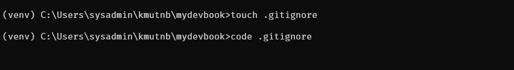
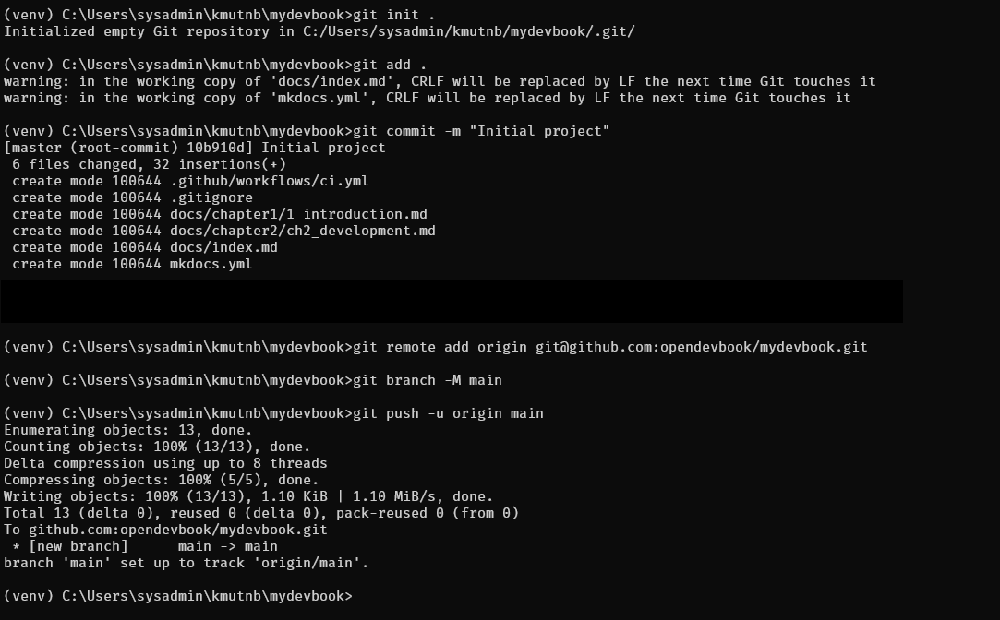
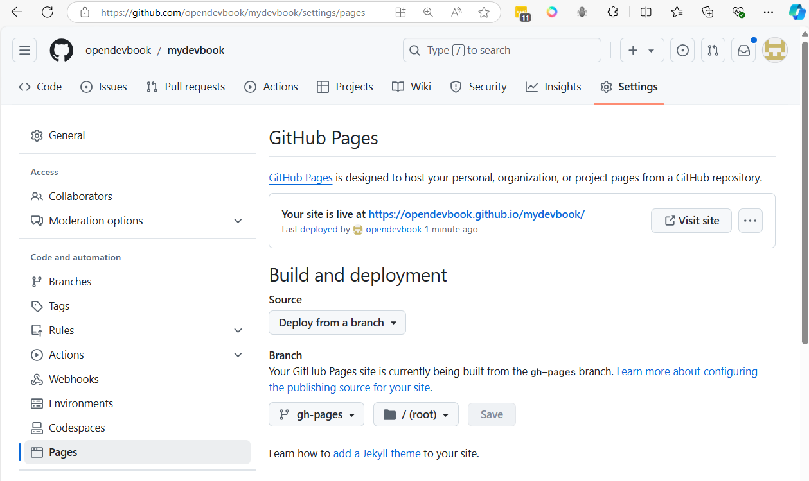

# workshop 2
Learn to Create Document Share for your Development with mkdocs

[https://www.mkdocs.org/getting-started/](https://www.mkdocs.org/getting-started/)


## create project
```
mkdir mydevbook
cd mydevbook
python -m venv venv
venv\Scripts\activate
pip install mkdocs
```


```
mkdocs new  .
mkdocs serve
```


Result


Control + C stop Server

#### Change themes to material
```
pip install mkdocs-material
```

Edit file  mkdocs.yml in project
```
site_name: My Docs
theme:
  name: material

markdown_extensions:
  - pymdownx.highlight:
      anchor_linenums: true
      line_spans: __span
      pygments_lang_class: true
  - pymdownx.inlinehilite
  - pymdownx.snippets
  - pymdownx.superfences
```

- Restart Server again
```
mkdocs serve 
```


## Create pages
- Create folder and inside folder crate markdown file


## Add pipline  ```./github/workflows/ci.yml```
```
mkdir .github
cd .github
mkdir workflows
cd workflows
touch ci.yml
```


create file ci.yml
```
name: CI

on:
  push:
    branches:
      - main

permissions:
  contents: write

jobs:
  deploy:
    runs-on: ubuntu-latest

    steps:
      - name: Checkout code
        uses: actions/checkout@v4

      - name: Configure Git Credentials
        run: |
          git config user.name "github-actions[bot]"
          git config user.email "41898282+github-actions[bot]@users.noreply.github.com"

      - name: Set up Python
        uses: actions/setup-python@v5
        with:
          python-version: '3.x'

      - name: Cache MkDocs dependencies
        run: echo "cache_id=$(date --utc '+%V')" >> $GITHUB_ENV
      
      - uses: actions/cache@v4
        with:
          key: mkdocs-material-${{ env.cache_id }}
          path: .cache

      - name: Install MkDocs and dependencies
        run: |
          pip install mkdocs-material

      - name: Build and Deploy MkDocs
        run: mkdocs gh-deploy --force
```

## Create project in github name mydevbook


- Copy script to project


```
cd mydevbook
touch .gitignore
```

add venv to .gitignore (with vscode)
```
venv
```



```
git init .
git add .
git commit -m "Initial project"
git remote add origin git@github.com:<youraccount>/mydevbook.git
git push origin main
```



- Go to git Actions to check pipeline


- Go to Settings  > Pages and select Branch  gh-pages and save


- Go back to actions it will generate action


- Go back to Settings > Pages again



Git will provide link to web  
[https://opendevbook.github.io/mydevbook/][https://opendevbook.github.io/mydevbook/]

