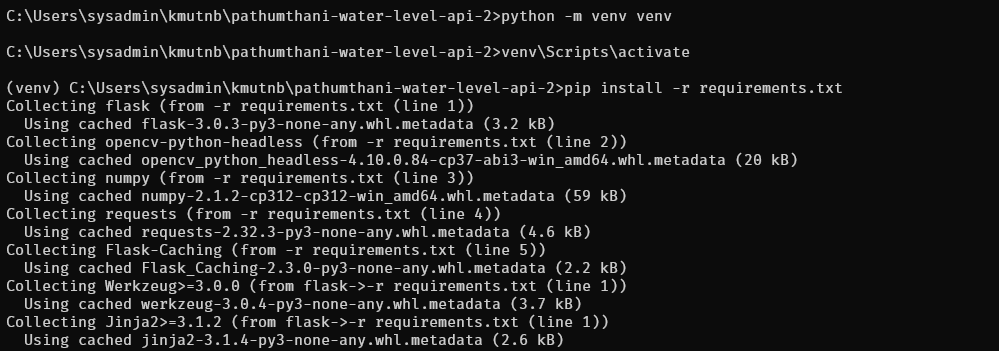
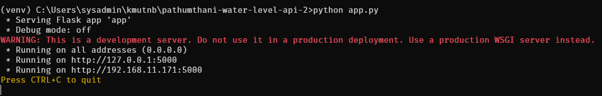
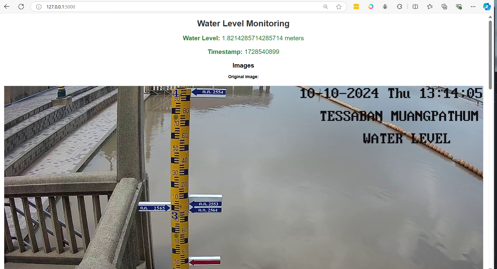
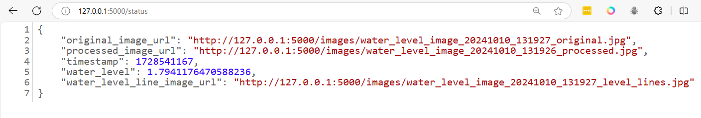

# workshop 3 image proces with opencv on Python project

**- Clone project**
```
git clone https://github.com/opendevbook/pathumthani-water-level-api-2.git
```

**- add python environment**
```
cd pathumthani-water-level-api-2
rmdir /s /q  .git
python -m venv venv
venv\Scripts\activate
pip install -r requirements.txt
```



**- Start application**
```
python app.py
```



**- Open browser http://127.0.0.1**



**- Open browser http://127.0.0.1/status**




**change  .github/workflows/docker-build.yml**
```
name: Docker Image CI pathumthani-water-level

on:
  push:
    branches: [ "main" ]
  pull_request:
    branches: [ "main" ]

jobs:
  build:
    runs-on: ubuntu-latest

    steps:
    - uses: actions/checkout@v4
    - name: Build the Docker images
      run: |
        docker build . -t ${{ secrets.DOCKER_HUB_ACCOUNT }}/pathumthani-water-level:latest

    - name: Login to Docker Hub
      run: |
        echo "${{ secrets.DOCKER_HUB_PASSWORD }}" | docker login -u ${{ secrets.DOCKER_HUB_ACCOUNT }} --password-stdin

    - name: Push images to Docker Hub
      run: |
        docker push ${{ secrets.DOCKER_HUB_ACCOUNT }}/pathumthani-water-level:latest

```