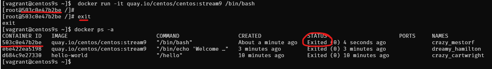

# Install Docker on CentOs 9 Stream

Docker simplifies the process of managing application processes in containers, which are isolated from each other and the host system. This isolation improves the security and efficiency of deploying applications.

## Step1 Add Docker Repository
- install docker latest version from docker inc
```
$ sudo dnf install -y yum-utils device-mapper-persistent-data lvm2
$ sudo dnf config-manager --add-repo=https://download.docker.com/linux/centos/docker-ce.repo
$ sudo dnf repolist -v
```

## Step2 Install  
- Install Docker CE
```
$ sudo dnf install docker-ce
```


## Step3 Enable and Start Docker Service
```
$ sudo systemctl enable --now docker
$ sudo systemctl status docker
```


## Step3 Check info
- Check info `sudo docker info`
```
$ sudo docker version
$ sudo docker info
Client: Docker Engine - Community
 Version:    27.1.2
 Context:    default
 Debug Mode: false
 Plugins:
  buildx: Docker Buildx (Docker Inc.)
    Version:  v0.16.2
    Path:     /usr/libexec/docker/cli-plugins/docker-buildx
  compose: Docker Compose (Docker Inc.)
    Version:  v2.29.1
    Path:     /usr/libexec/docker/cli-plugins/docker-compose

Server:
 Containers: 0
  Running: 0
  Paused: 0
  Stopped: 0
 Images: 0
 Server Version: 27.1.2
 Storage Driver: overlay2
  Backing Filesystem: xfs
  Supports d_type: true
  Using metacopy: false
  Native Overlay Diff: true
  userxattr: false
 Logging Driver: json-file
 Cgroup Driver: systemd
 Cgroup Version: 2
 Plugins:
  Volume: local
  Network: bridge host ipvlan macvlan null overlay
  Log: awslogs fluentd gcplogs gelf journald json-file local splunk syslog
 Swarm: inactive
 Runtimes: io.containerd.runc.v2 runc
 Default Runtime: runc
 Init Binary: docker-init
 containerd version: 8fc6bcff51318944179630522a095cc9dbf9f353
 runc version: v1.1.13-0-g58aa920
 init version: de40ad0
 Security Options:
  seccomp
   Profile: builtin
  cgroupns
 Kernel Version: 5.14.0-391.el9.x86_64
 Operating System: CentOS Stream 9
 OSType: linux
 Architecture: x86_64
 CPUs: 2
 Total Memory: 1.734GiB
 Name: centos9s.localdomain
 ID: 25e199fb-abb2-4ef6-9ceb-f843d3c50b8c
 Docker Root Dir: /var/lib/docker
 Debug Mode: false
 Experimental: false
 Insecure Registries:
  127.0.0.0/8
 Live Restore Enabled: false
```

## Step4 Manage Docker as Non-root user
- By default, running Docker requires root privileges. However, you can add your user to the Docker group to manage Docker as a non-root user. 

```
$ sudo usermod -aG docker $(whoami)
$ newgrp docker
$ docker ps
CONTAINER ID   IMAGE     COMMAND   CREATED   STATUS    PORTS     NAMES
```
> user `newgrp docker` or logout and re login again

- Check file system of docker and containerd
```
[vagrant@centos9s ~]$ sudo ls -l  /var/lib/docker/
total 12
drwx--x--x.  4 root root  138 Aug 21 13:58 buildkit
drwx--x---.  5 root root 4096 Aug 21 14:15 containers
-rw-------.  1 root root   36 Aug 21 13:58 engine-id
drwx------.  3 root root   22 Aug 21 13:58 image
drwxr-x---.  3 root root   19 Aug 21 13:58 network
drwx--x---. 11 root root 4096 Aug 21 14:15 overlay2
drwx------.  4 root root   32 Aug 21 13:58 plugins
drwx------.  2 root root    6 Aug 21 13:58 runtimes
drwx------.  2 root root    6 Aug 21 13:58 swarm
drwx------.  2 root root    6 Aug 21 14:12 tmp
drwx-----x.  2 root root   50 Aug 21 13:58 volumes
[vagrant@centos9s ~]$ sudo ls -l  /var/lib/containerd/
total 0
drwxr-xr-x. 4 root root 33 Aug 21 14:06 io.containerd.content.v1.content
drwx--x--x. 2 root root 21 Aug 21 13:58 io.containerd.metadata.v1.bolt
drwx--x--x. 2 root root  6 Aug 21 13:58 io.containerd.runtime.v1.linux
drwx--x--x. 3 root root 18 Aug 21 14:06 io.containerd.runtime.v2.task
drwx------. 2 root root  6 Aug 21 13:58 io.containerd.snapshotter.v1.blockfile
drwx------. 3 root root 23 Aug 21 13:58 io.containerd.snapshotter.v1.native
drwx------. 3 root root 23 Aug 21 13:58 io.containerd.snapshotter.v1.overlayfs
drwx------. 2 root root  6 Aug 21 13:58 tmpmounts
```
## Step5 Run Test Docker Container
- Test with image `hello-world`
```
$ docker run hello-world

Unable to find image 'hello-world:latest' locally
latest: Pulling from library/hello-world
c1ec31eb5944: Pull complete
Digest: sha256:53cc4d415d839c98be39331c948609b659ed725170ad2ca8eb36951288f81b75
Status: Downloaded newer image for hello-world:latest

Hello from Docker!
This message shows that your installation appears to be working correctly.

To generate this message, Docker took the following steps:
 1. The Docker client contacted the Docker daemon.
 2. The Docker daemon pulled the "hello-world" image from the Docker Hub.
    (amd64)
 3. The Docker daemon created a new container from that image which runs the
    executable that produces the output you are currently reading.
 4. The Docker daemon streamed that output to the Docker client, which sent it
    to your terminal.

To try something more ambitious, you can run an Ubuntu container with:
 $ docker run -it ubuntu bash

Share images, automate workflows, and more with a free Docker ID:
 https://hub.docker.com/

For more examples and ideas, visit:
 https://docs.docker.com/get-started/

```

## Step6  Check image
- Check image
```
$ docker image ls
REPOSITORY    TAG       IMAGE ID       CREATED         SIZE
hello-world   latest    d2c94e258dcb   15 months ago   13.3kB
```

## Step 7 Download image 
- download image of centos 9 stream from quay.io repository
```
$ docker pull quay.io/centos/centos:stream9

stream9: Pulling from centos/centos
26ef76492da3: Pull complete
Digest: sha256:a0017fa930fbbbb706509aafdb287b16d9d3d1672f09712a04ea634fea68a85d
Status: Downloaded newer image for quay.io/centos/centos:stream9
quay.io/centos/centos:stream9
```
- Run echo command inside container, then container will stop 
```
$ docker run quay.io/centos/centos:stream9 /bin/echo "Welcome to the Docker World!"
Welcome to the Docker World!
```

## Step 8 Run container with `-it` option to connect to interactive session
```
$  docker run -it quay.io/centos/centos:stream9 /bin/bash
[root@503c0e47b2be /]# uname -a
[root@503c0e47b2be /]# exit
```
- after `exit` you will return back to origin shell and container will stop
- Check container
```
$ docker ps -a

```


>  **Note:** you can exit container without stop container by use `Ctrl+p, Ctrl+q`

## Step 8 Install docker compose
- [https://docs.docker.com/compose/](https://docs.docker.com/compose/)

Docker Compose is a tool for defining and running multi-container applications. It is the key to unlocking a streamlined and efficient development and deployment experience.

Compose simplifies the control of your entire application stack, making it easy to manage services, networks, and volumes in a single, comprehensible YAML configuration file. Then, with a single command, you create and start all the services from your configuration file.

Compose works in all environments; production, staging, development, testing, as well as CI workflows. It also has commands for managing the whole lifecycle of your application:

- [https://github.com/docker/compose/](https://github.com/docker/compose/)

```
$ sudo dnf install docker-compose-plugin
```
- Check version docker compose
```
$ docker compose version
Docker Compose version v2.29.1
```

## Step 8 Configure an application that has web and DB services with Docker Compose

```
$ mkdir web_db
$ cd web_db
$ vim Dockerfile
```
- add content of docker file from below
```bash
FROM quay.io/centos/centos:stream9
MAINTAINER ServerWorld <admin@srv.world>

RUN dnf -y install nginx

EXPOSE 80
CMD ["/usr/sbin/nginx", "-g", "daemon off;"]
```

- define application configuration
```
$ vim docker-compose.yml
```
- add content of docker compose
```yml
services:
  db:
    image: mariadb
    volumes:
      - /var/lib/docker/disk01:/var/lib/mysql
    environment:
      MYSQL_ROOT_PASSWORD: password
      MYSQL_USER: cent
      MYSQL_PASSWORD: password
      MYSQL_DATABASE: cent_db
    ports:
      - "3306:3306"
  web:
    build: .
    ports:
      - "80:80"
    volumes:
      - /var/lib/docker/disk02:/usr/share/nginx/html
```
- Build and run docker compose
```
$ docker compose up -d
```
- Result of command
```
$ docker compose up -d
[+] Running 9/9
 ✔ db Pulled                                                                                   20.5s
   ✔ 31e907dcc94a Pull complete                                                                 4.8s
   ✔ 8687fa065e6d Pull complete                                                                 4.9s
   ✔ bc75b4546118 Pull complete                                                                 5.5s
   ✔ 90824338d93e Pull complete                                                                 5.5s
   ✔ c13aedba8d5d Pull complete                                                                 5.6s
   ✔ ad9066662cff Pull complete                                                                15.9s
   ✔ 537f82e52967 Pull complete                                                                16.0s
   ✔ a5e6bca88fae Pull complete                                                                16.0s
[+] Building 52.5s (7/7) FINISHED                                                     docker:default
 => [web internal] load build definition from Dockerfile                                        0.1s
 => => transferring dockerfile: 256B                                                            0.0s
 => WARN: MaintainerDeprecated: Maintainer instruction is deprecated in favor of using label (  0.1s
 => [web internal] load metadata for quay.io/centos/centos:stream9                              0.0s
 => [web internal] load .dockerignore                                                           0.0s
 => => transferring context: 2B                                                                 0.0s
 => [web 1/2] FROM quay.io/centos/centos:stream9                                                0.0s
 => [web 2/2] RUN dnf -y install nginx                                                         51.4s
 => [web] exporting to image                                                                    0.8s
 => => exporting layers                                                                         0.8s
 => => writing image sha256:2054d035639c4bc56c2dcb6a4c34351f8a6a18e08d53c759af55a977ad217341    0.0s
 => => naming to docker.io/library/web_db-web                                                   0.0s
 => [web] resolving provenance for metadata file                                                0.0s
[+] Running 3/3
 ✔ Network web_db_default  Created                                                              0.6s
 ✔ Container web_db-web-1  Started                                                              0.6s
 ✔ Container web_db-db-1   Started                                                              0.6s
```

- Confirm running container
```
$ docker ps
CONTAINER ID   IMAGE        COMMAND                  CREATED              STATUS              PORTS                    NAMES
1cc94e9479fd   mariadb      "docker-entrypoint.s…"   About a minute ago   Up About a minute   0.0.0.0:3306->3306/tcp   web_db-db-1
5d95646a1f62   web_db-web   "/usr/sbin/nginx -g …"   About a minute ago   Up About a minute   0.0.0.0:80->80/tcp       web_db-web-1
```

- Test Verify access to database
```
$ sudo dnf install mysql
$ mysql -h 127.0.0.1 -u root -p -e "show variables like 'hostname';"
Enter password:
+---------------+--------------+
| Variable_name | Value        |
+---------------+--------------+
| hostname      | 1cc94e9479fd |
+---------------+--------------+

$ mysql -h 127.0.0.1 -u cent -p -e "show databases;"
Enter password:
+--------------------+
| Database           |
+--------------------+
| cent_db            |
| information_schema |
+--------------------+
```

- Add index.html content
```
$ sudo su -
# echo "Hello Docker Compose World" > /var/lib/docker/disk02/index.html
# curl 127.0.0.1
Hello Docker Compose World

# exit
```

## Docker compose command
- check container process
```
$ docker compose ps
NAME           IMAGE        COMMAND                  SERVICE   CREATED         STATUS         PORTS
web_db-db-1    mariadb      "docker-entrypoint.s…"   db        7 minutes ago   Up 7 minutes   0.0.0.0:3306->3306/tcp
web_db-web-1   web_db-web   "/usr/sbin/nginx -g …"   web       7 minutes ago   Up 7 minutes   0.0.0.0:80->80/tcp
```
- Access to services (container)
Servers list  db and web. 

```
$ docker compose exec db /bin/bash
root@1cc94e9479fd:/# exit
```

```
$ docker compose exec web /bin/bash
[root@5d95646a1f62 /]# exit
```

- Stop container
```
$ docker compose stop
[+] Stopping 2/2
 ✔ Container web_db-db-1   Stopped                                                                                                                              0.4s
 ✔ Container web_db-web-1  Stopped   
```

- Start up a service only web
```
$ docker compose up -d web
[+] Running 1/1
 ✔ Container web_db-web-1  Started                                                                                              
                                 0.3s
$ docker compose ps
NAME           IMAGE        COMMAND                  SERVICE   CREATED          STATUS         PORTS
web_db-web-1   web_db-web   "/usr/sbin/nginx -g …"   web       13 minutes ago   Up 6 seconds   0.0.0.0:80->80/tcp
```

- Delete container
```
$ docker compose down
[+] Running 3/3
 ✔ Container web_db-web-1  Removed                                                                                                                              0.0s
 ✔ Container web_db-db-1   Removed                                                                                                                              0.0s
 ✔ Network web_db_default  Removed                                                                                                                              0.2s
 ```