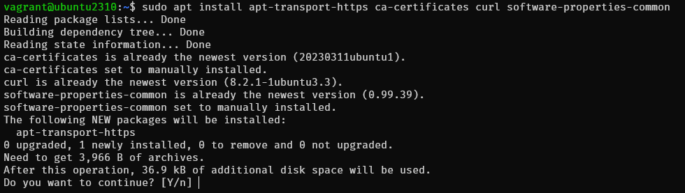
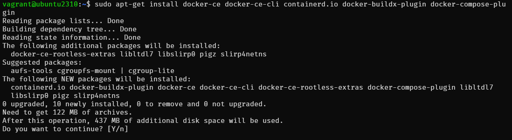
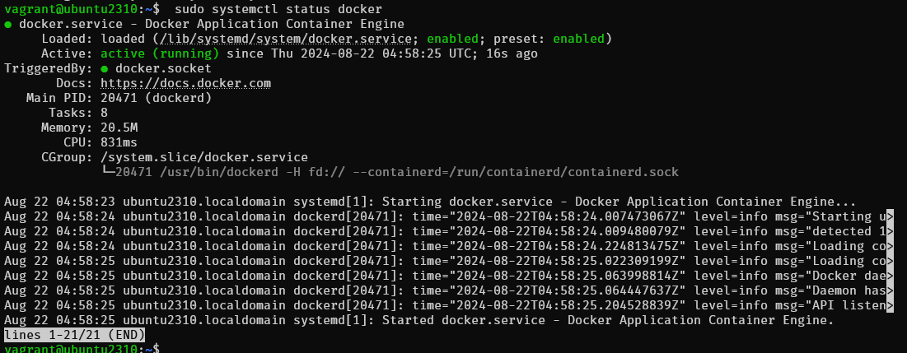
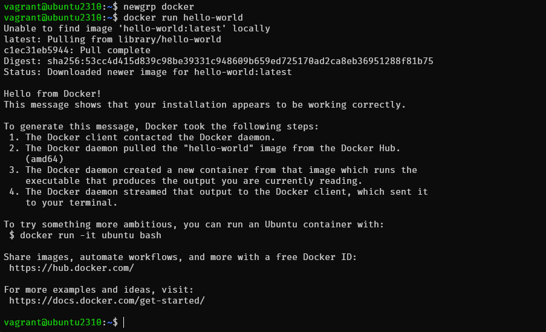

# Install Docker on Ubuntu 2310

```
$ cat /etc/os-release

PRETTY_NAME="Ubuntu 23.10"
NAME="Ubuntu"
VERSION_ID="23.10"
VERSION="23.10 (Mantic Minotaur)"
VERSION_CODENAME=mantic
ID=ubuntu
ID_LIKE=debian
HOME_URL="https://www.ubuntu.com/"
SUPPORT_URL="https://help.ubuntu.com/"
BUG_REPORT_URL="https://bugs.launchpad.net/ubuntu/"
PRIVACY_POLICY_URL="https://www.ubuntu.com/legal/terms-and-policies/privacy-policy"
UBUNTU_CODENAME=mantic
LOGO=ubuntu-logo
```

- Step 1 : Update the package index:
```
$ sudo apt update -y
```

- Step 2 : Install prerequisites:
```
$ sudo apt install apt-transport-https ca-certificates curl software-properties-common
```


- Step 3 : Add the Docker GPG key:
```
curl -fsSL https://download.docker.com/linux/ubuntu/gpg | sudo gpg --dearmor -o /usr/share/keyrings/docker-archive-keyring.gpg
```

- Step 4 : Add the Docker APT repository
```
echo "deb [arch=$(dpkg --print-architecture) signed-by=/usr/share/keyrings/docker-archive-keyring.gpg] https://download.docker.com/linux/ubuntu $(lsb_release -cs) stable" | sudo tee /etc/apt/sources.list.d/docker.list > /dev/null
```

- Step 5 : Update the package index again:
```
sudo apt update
```

- Step 6 : Install latest version
```
$ sudo apt-get install docker-ce docker-ce-cli containerd.io docker-buildx-plugin docker-compose-plugin
```


- Step 7 Start and Enable Docker
Once the installation is complete, we can start and enable the Docker service. Run the following command:
```
$ sudo systemctl enable --now docker
$ sudo systemctl status docker

```



- Step 7 : Create Docker group
To avoid having to use sudo each time we run Docker, it is recommended to add your user to the Docker group. To create the Docker group, run the following command:
```
$ sudo groupadd docker
groupadd: group 'docker' already exists

$ sudo usermod -aG docker $USER
$ newgrp docker
```

- Step 8 : Test 
```
$ docker run hello-world
```

