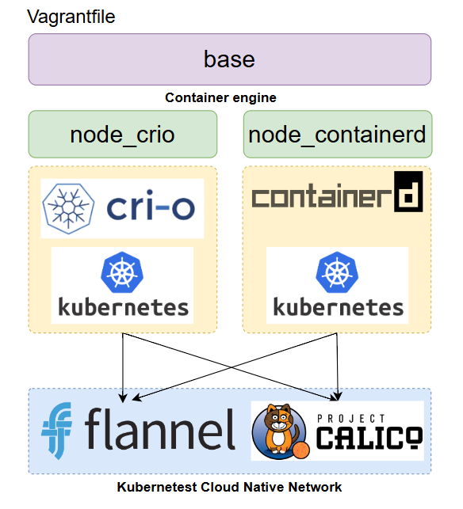
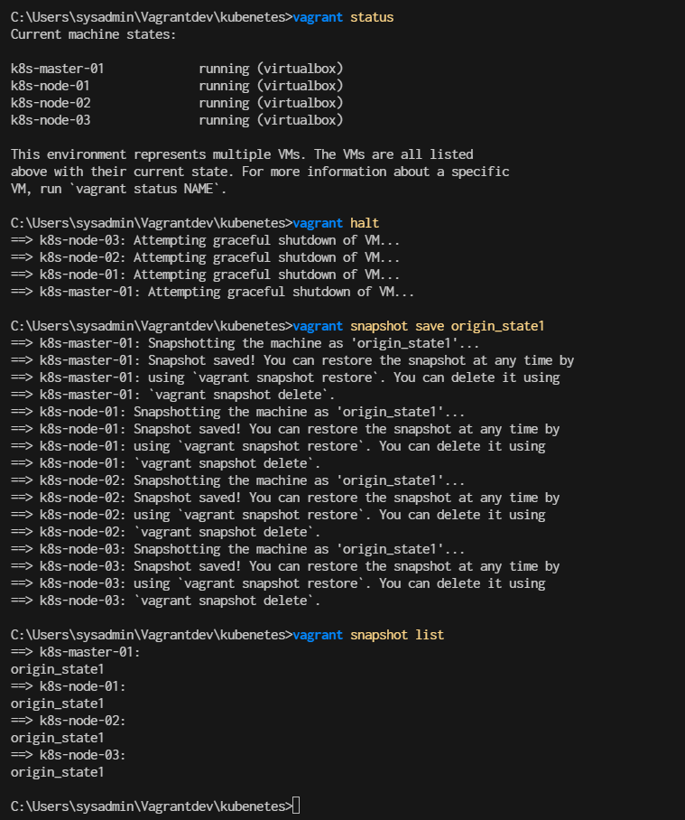
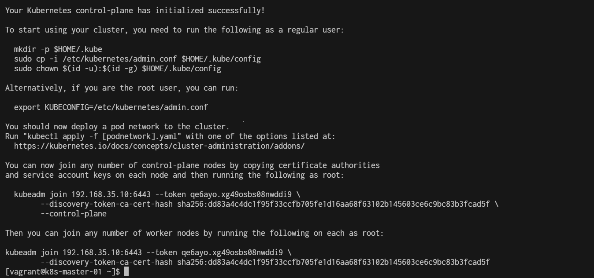
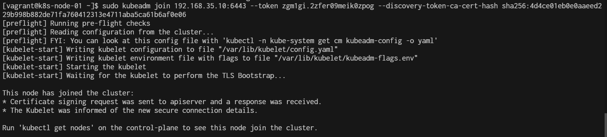
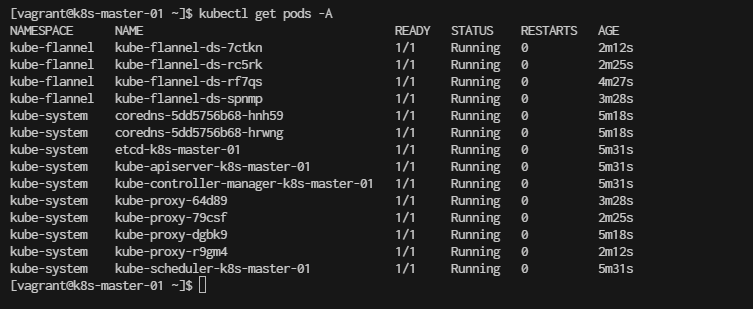

# install kubernetest



**Vagrantfile**
```
# -*- mode: ruby -*-
# vi: set ft=ruby :

# All Vagrant configuration is done below. The "2" in Vagrant.configure
# configures the configuration version (we support older styles for
# backwards compatibility). Please don't change it unless you know what
# you're doing.

$base=<<-SCRIPT
    echo ">>> Run Kubernetes Base script"
    echo "-----------------------------------------------"
    echo "\nStep-1 Enable ssh password authentication"
    echo $(whoami)
    sed -i 's/PasswordAuthentication no/PasswordAuthentication yes/g' /etc/ssh/sshd_config    
    systemctl restart sshd.service
    echo "\nStep-2 Enable firewall"
    sudo dnf update -y
    sudo dnf install -y firewalld socat
    sudo systemctl enable --now firewalld

    # Step-3 Disable SELinux
    echo "\nStep-3 Disable SELinux"
    sudo setenforce 0
    sudo sed -i 's/^SELINUX=enforcing$/SELINUX=permissive/' /etc/selinux/config


    # Step-4 manage kernel module
    echo "\nStep-4 manage kernel module"
cat <<EOF | sudo tee /etc/sysctl.d/k8s.conf
net.ipv4.ip_forward = 1
net.bridge.bridge-nf-call-ip6tables = 1
net.bridge.bridge-nf-call-iptables = 1
EOF

    sudo "show sysctl -p"
    sudo sysctl -p
    sudo sysctl --system
 
    # Load kernel module
cat <<EOF | sudo tee /etc/modules-load.d/k8s.conf 
overlay
br_netfilter
ip_vs
ip_vs_rr
ip_vs_wrr
ip_vs_sh
EOF
    sudo modprobe br_netfilter
    sudo modprobe ip_vs
    sudo modprobe ip_vs_rr
    sudo modprobe ip_vs_wrr
    sudo modprobe ip_vs_sh
    sudo modprobe overlay

    # Step-5: Disable swap permanently
    echo "\nStep-5: Disable swap permanently"
    sudo swapoff -a
    sudo sed -e '/swap/s/^/#/g' -i /etc/fstab

    # Step-6: Enable Enable firewall port
    echo "\nStep-6: Enable Enable firewall port"
    sudo firewall-cmd --zone=public --permanent --add-port=443/tcp
    sudo firewall-cmd --zone=public --permanent --add-port=6443/tcp
    sudo firewall-cmd --zone=public --permanent --add-port=2379-2380/tcp
    sudo firewall-cmd --zone=public --permanent --add-port=10250/tcp
    sudo firewall-cmd --zone=public --permanent --add-port=10251/tcp
    sudo firewall-cmd --zone=public --permanent --add-port=10252/tcp
    sudo firewall-cmd --zone=public --permanent --add-port=10255/tcp
    sudo firewall-cmd --zone=public --permanent --add-port=5473/tcp
    sudo firewall-cmd --permanent --add-port 10250/tcp --add-port 30000-32767/tcp 

    # Flannel port
    sudo firewall-cmd --permanent --add-port=8472/udp
    # Etcd port
    sudo firewall-cmd --permanent --add-port=2379-2380/tcp
    sudo firewall-cmd --reload

    
    # Step-7: Enable Hostname

    echo "Step7 Enable Hostname"
cat <<EOF | sudo tee /etc/hosts
127.0.0.1   localhost localhost.localdomain localhost4 localhost4.localdomain4
::1         localhost localhost.localdomain localhost6 localhost6.localdomain6

127.0.0.1 centos9s.localdomain

192.168.35.10  k8s-master-01 k8s-master-01
192.168.35.21  k8s-node-01  k8s-node-01
192.168.35.22  k8s-node-02  k8s-node-02
192.168.35.23  k8s-node-03  k8s-node-03
EOF

SCRIPT


$node_crio=<<-SCRIPT
    echo ">>> Run Kubernetes node script"
    echo "-----------------------------------------------"
    echo "\nStep1 Install crio engine"
    # Install crio engine
cat <<EOF | sudo tee /etc/yum.repos.d/crio.repo 
[cri-o]
name=CRI-O
baseurl=https://pkgs.k8s.io/addons:/cri-o:/prerelease:/main/rpm/
enabled=1
gpgcheck=1
gpgkey=https://pkgs.k8s.io/addons:/cri-o:/prerelease:/main/rpm/repodata/repomd.xml.key
EOF
    sudo dnf install -y cri-o
    sudo systemctl enable crio --now
    sudo systemctl status crio
    sudo journalctl -u crio

    # Install kubenetest
    echo "\nStep2 Install kubenetest"
cat <<EOF | sudo tee /etc/yum.repos.d/kubernetes.repo
[kubernetes]
name=Kubernetes
baseurl=https://pkgs.k8s.io/core:/stable:/v1.28/rpm/
enabled=1
gpgcheck=1
gpgkey=https://pkgs.k8s.io/core:/stable:/v1.28/rpm/repodata/repomd.xml.key
exclude=kubelet kubeadm kubectl cri-tools kubernetes-cni
EOF

  
    sudo dnf install -y kubelet kubeadm kubectl --disableexcludes=kubernetes
    sudo systemctl enable --now kubelet

    echo "\nRun command: sudo systemctl status kubelet"
    sudo systemctl status kubelet

    # Enable Bash completion for kubernetes command
    source <(kubectl completion bash)
    sudo kubectl completion bash | sudo tee  /etc/bash_completion.d/kubectl
SCRIPT

$node_containerd=<<-SCRIPT
    echo ">>> Run Kubernetes node script"
    echo "-----------------------------------------------"
    echo "\nStep1 Install containerd engine"
    # Install docker engine
    sudo dnf config-manager --add-repo=https://download.docker.com/linux/centos/docker-ce.repo
    sudo dnf install -y docker-ce docker-ce-cli containerd.io
    sudo systemctl enable --now docker
    sudo usermod -aG docker vagrant
    
    # install containerd daemon
    sudo dnf install -y containerd.io
    sudo systemctl enable --now containerd

    # Install kubenetest
    echo "\nStep2 Install kubenetest"
cat <<EOF | sudo tee /etc/yum.repos.d/kubernetes.repo
[kubernetes]
name=Kubernetes
baseurl=https://pkgs.k8s.io/core:/stable:/v1.28/rpm/
enabled=1
gpgcheck=1
gpgkey=https://pkgs.k8s.io/core:/stable:/v1.28/rpm/repodata/repomd.xml.key
exclude=kubelet kubeadm kubectl cri-tools kubernetes-cni
EOF

  
    sudo dnf install -y kubelet kubeadm kubectl --disableexcludes=kubernetes
    sudo systemctl enable --now kubelet

    echo "\nRun command: sudo systemctl status kubelet"
    sudo systemctl status kubelet

    source <(kubectl completion bash)
    sudo kubectl completion bash | sudo tee  /etc/bash_completion.d/kubectl

    echo "\nStep3 Config containerd with systemdCroup"
    sudo mv /etc/containerd/config.toml  /etc/containerd/config.toml.orgi
    sudo containerd config default | sudo tee /etc/containerd/config.toml
    sudo sed -i 's/SystemdCgroup = false/SystemdCgroup = true/g' /etc/containerd/config.toml
   
    sudo systemctl restart containerd   
    sudo systemctl status containerd.service
    echo "\mStep4 Test pull and run image"
    sudo ctr image pull docker.io/library/hello-world:latest
    sudo ctr run --rm docker.io/library/hello-world:latest test
SCRIPT

Vagrant.configure("2") do |config|
  # The most common configuration options are documented and commented below.
  # For a complete reference, please see the online documentation at
  # https://docs.vagrantup.com.
  config.vm.box = "generic/centos9s"

  config.vm.define "k8s-master-01" do |control|
    control.vm.hostname = "k8s-master-01"
    control.vm.network "private_network", ip: "192.168.35.10"
    control.vm.provider "virtualbox" do |vb|
      vb.memory = "4096"
      vb.cpus = 4
    end

    control.vm.provision "shell", inline: $base
    control.vm.provision "shell", inline: $node_containerd
  end

  config.vm.define "k8s-node-01" do |node1|
    node1.vm.hostname = "k8s-node-01"
    node1.vm.network "private_network", ip: "192.168.35.21"
    node1.vm.provider "virtualbox" do |vb|
      vb.memory = "2048"
      vb.cpus = 2
    end

    node1.vm.provision "shell", inline: $base
    node1.vm.provision "shell", inline: $node_containerd
  end

  config.vm.define "k8s-node-02" do |node2|
    node2.vm.hostname = "k8s-node-02"
    node2.vm.network "private_network", ip: "192.168.35.22"
    node2.vm.provider "virtualbox" do |vb|
      vb.memory = "2048"
      vb.cpus = 2
    end
    node2.vm.provision "shell", inline: $base
    node2.vm.provision "shell", inline: $node_containerd
  end

  config.vm.define "k8s-node-03" do |node3|
    node3.vm.hostname = "k8s-node-03"
    node3.vm.network "private_network", ip: "192.168.35.23"
    node3.vm.provider "virtualbox" do |vb|
      vb.memory = "2048"
      vb.cpus = 2
    end
    node3.vm.provision "shell", inline: $base
    node3.vm.provision "shell", inline: $node_containerd
  end

  #config.vm.synced_folder ".", "/vagrant"


  
end
```


**Start vagrant **
```
vagrant up
vagrant status
vagrant halt
vagrant snapshot save origin_state1
vagrant snapshot list
```
- first snapshot is clean state before cluster



**Restore origin_state and install k8s**
- restore vagrant
- ssh to k8s-master-01(192.168.35.10)
```
vagrant snapshot restore origin_state1
vagrant ssh k8s-master-01
```

**Download pull image and install k8s master with ```kubectl init```**
```
$ sudo kubeadm config images pull

$ sudo kubeadm init \
  --control-plane-endpoint=192.168.35.10 \
  --pod-network-cidr=10.244.0.0/16 \
  --apiserver-advertise-address=192.168.35.10
```
- For flannel to work correctly, you must pass --pod-network-cidr=10.244.0.0/16 to kubeadm init. Result Screen:
- Run as vagrant use or normal user. we need to copy file admin.conf to vagrant use,, by run command



**copy admin.conf to user vagrant**
```
mkdir -p $HOME/.kube
sudo cp -i /etc/kubernetes/admin.conf /home/vagrant/.kube/config
sudo chown $(id -u vagrant):$(id -g vagrant) /home/vagrant/.kube/config
```

**Run Command kubectl get nodes**
```
kubectl  get nodes
NAME            STATUS     ROLES           AGE     VERSION
k8s-master-01   NotReady   control-plane   4m15s   v1.28.13
```
- Status must show NotReady 

**Install Flannel network to Fix**
Install Pod network flannel
Install a Pod Network Addon: You need to deploy a network plugin that matches the --pod-network-cidr you specified. For Flannel, you can apply the Flannel YAML file:

```
$ kubectl apply -f https://raw.githubusercontent.com/flannel-io/flannel/master/Documentation/kube-flannel.yml

namespace/kube-flannel created
serviceaccount/flannel created
clusterrole.rbac.authorization.k8s.io/flannel created
clusterrolebinding.rbac.authorization.k8s.io/flannel created
configmap/kube-flannel-cfg created
daemonset.apps/kube-flannel-ds created

```

Check flannel is running correct
```
[vagrant@k8s-master-01 ~]$ kubectl get daemonset kube-flannel-ds -n kube-flannel
```


**Recreate join string to worker node**
```
sudo kubeadm token create --print-join-command
```
- we will copy output to workernode 

## Add Kubernetes node workload to master
now our master node is already runing

- Then you can join any number of worker nodes by running the following on each as root:
- Run command in k8s-node-01,k8s-node-02,k8s-node-03

**Now Join Cluster with kubeadm join string**
- Vagrant ssh to k8s-node-01 ( Repeat this stop in k8s-node-02, k8s-node-03)
- Open another 3 tabs in windows
    - Tab 1 for k8s-node-01
    - Tab 2 for k8s-node-02
    - Tab 3 for k8s-node-03

Example for node1
```
$ vagrant ssh k8s-node-01
```
- Run join string 
```
sudo kubeadm join 192.168.35.10:6443 --token <Token> --discovery-token-ca-cert-hash  <Cert>
```
example:
```
sudo kubeadm join 192.168.35.10:6443 --token qe6ayo.xg49osbs08nwddi9 \
        --discovery-token-ca-cert-hash sha256:dd83a4c4dc1f95f33ccfb705fe1d16aa68f63102b145603ce6c9bc83b3fcad5f
```



# Remember Repeat in k8s-node-02, k8s-node-03

Verify pods After join Worker node




**Vagrant halt and crate snapshopt**
```
> vagrant halt
> vagrant snapshot save origin_k8s_fresh
> vagrant snapshot list
```