# install minikube

**What is Minikube?**
Minikube is a tool that enables developers to run a single-node Kubernetes cluster locally on their machine. It simplifies Kubernetes development and testing by providing an easy-to-use environment that closely mimics a production Kubernetes cluster. With Minikube, developers can quickly prototype, deploy, and debug applications, making it an essential tool for building and testing Kubernetes-based solutions. Its benefits include fast setup, isolation, reproducibility, and the ability to develop and test Kubernetes applications without the need for a full-scale cluster.

Most users of this driver should consider the newer Docker driver, as it is significantly easier to configure and does not require root access. The ’none’ driver is recommended for advanced users only.

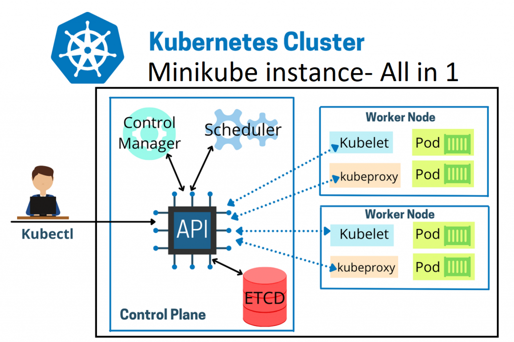

on window create folder for project vm
```
mkdir minikube
cd minikube
code Vagrantfile
```

```ruby
# -*- mode: ruby -*-
# vi: set ft=ruby :

Vagrant.configure("2") do |config|

  config.vm.box = "generic/centos9s"
  config.vm.network "private_network", ip: "192.168.40.10"

  # config.vm.network "public_network"

  # config.vm.synced_folder "../data", "/vagrant_data"

  #config.vm.synced_folder ".", "/vagrant"


  config.vm.provider "virtualbox" do |vb|
      vb.memory = "4096"
      vb.cpus = 4
  end

  config.vm.provision "shell", inline: <<-SHELL
    echo "\nStep-1 Enable ssh password authentication"
    echo $(whoami)
    sed -i 's/PasswordAuthentication no/PasswordAuthentication yes/g' /etc/ssh/sshd_config    
    systemctl restart sshd.service

    #add docker repository
    sudo dnf install -y yum-utils device-mapper-persistent-data lvm2
    sudo dnf config-manager --add-repo=https://download.docker.com/linux/centos/docker-ce.repo
    sudo dnf repolist -v
    #install docker
    sudo dnf install docker-ce -y
    sudo systemctl enable --now docker
    sudo systemctl status docker
    # add vagrant user to docker group
    sudo groupadd docker
    sudo usermod -aG docker vagrant
    sudo -i -u vagrant newgrp docker

    echo "\>> Status docker "
    sudo systemctl status docker
    # Run docker ps
    echo "Run Test docker command"
    docker ps
cat <<EOF | sudo tee /etc/yum.repos.d/kubernetes.repo
[kubernetes]
name=Kubernetes
baseurl=https://pkgs.k8s.io/core:/stable:/v1.28/rpm/
enabled=1
gpgcheck=1
gpgkey=https://pkgs.k8s.io/core:/stable:/v1.28/rpm/repodata/repomd.xml.key
exclude=kubelet kubeadm kubectl cri-tools kubernetes-cni
EOF

    sudo dnf install -y kubelet kubeadm kubectl --disableexcludes=kubernetes
    sudo systemctl enable --now kubelet
    sudo systemctl status kubelet

  echo "kubectl version --output=yaml"
  sudo kubectl version --output=yaml

  #Download minikube
  curl -LO https://storage.googleapis.com/minikube/releases/latest/minikube-linux-amd64
  sudo chmod +x minikube-linux-amd64

  sudo mv minikube-linux-amd64 /usr/local/bin/minikube

  SHELL
end
```

- Create VM with provision
```
vagrant up --provision
vagrant ssh
```

- Start Minikube
```
$ minikube start
```

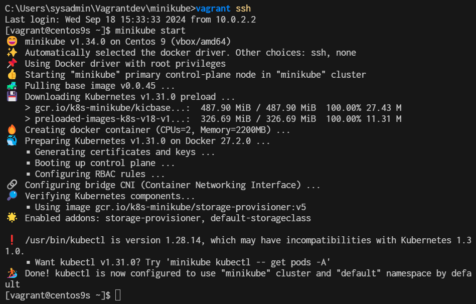


- Verify Installation

```
$ minikube status
```
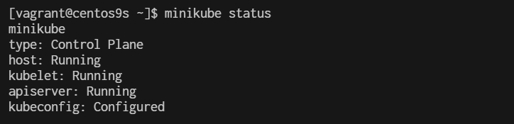

```
$ kubectl cluster-info
Kubernetes control plane is running at https://192.168.49.2:8443
CoreDNS is running at https://192.168.49.2:8443/api/v1/namespaces/kube-system/services/kube-dns:dns/proxy
```
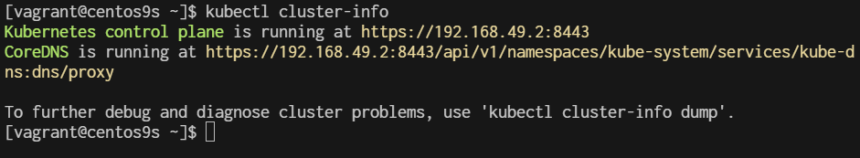

```
[vagrant@centos9s ~]$ minikube ip
192.168.49.2
[vagrant@centos9s ~]$ kubectl get nodes
NAME       STATUS   ROLES           AGE   VERSION
minikube   Ready    control-plane   24m   v1.31.0
[vagrant@centos9s ~]$ kubectl get pods -A
NAMESPACE              NAME                                        READY   STATUS    RESTARTS        AGE
kube-system            coredns-6f6b679f8f-fqg9g                    1/1     Running   1 (5m51s ago)   24m
kube-system            etcd-minikube                               1/1     Running   1 (5m55s ago)   24m
kube-system            kube-apiserver-minikube                     1/1     Running   1 (3m20s ago)   24m
kube-system            kube-controller-manager-minikube            1/1     Running   1 (5m55s ago)   24m
kube-system            kube-proxy-66dtw                            1/1     Running   1 (5m56s ago)   24m
kube-system            kube-scheduler-minikube                     1/1     Running   1 (5m55s ago)   24m
kube-system            storage-provisioner                         1/1     Running   3 (2m25s ago)   24m
kubernetes-dashboard   dashboard-metrics-scraper-c5db448b4-rdbmf   1/1     Running   1 (5m56s ago)   19m
kubernetes-dashboard   kubernetes-dashboard-695b96c756-nw2tv       1/1     Running   1 (5m56s ago)   19m
[vagrant@centos9s ~]$
```

- run kubectl get pods
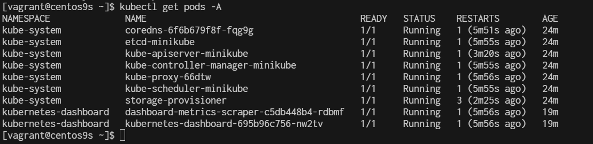


## Managing Addons on Minikube

By default, several addons have been enable during the Minikube instalallation. To see the addons of Minikube, run the following command:

```
$ minikube addons list
```

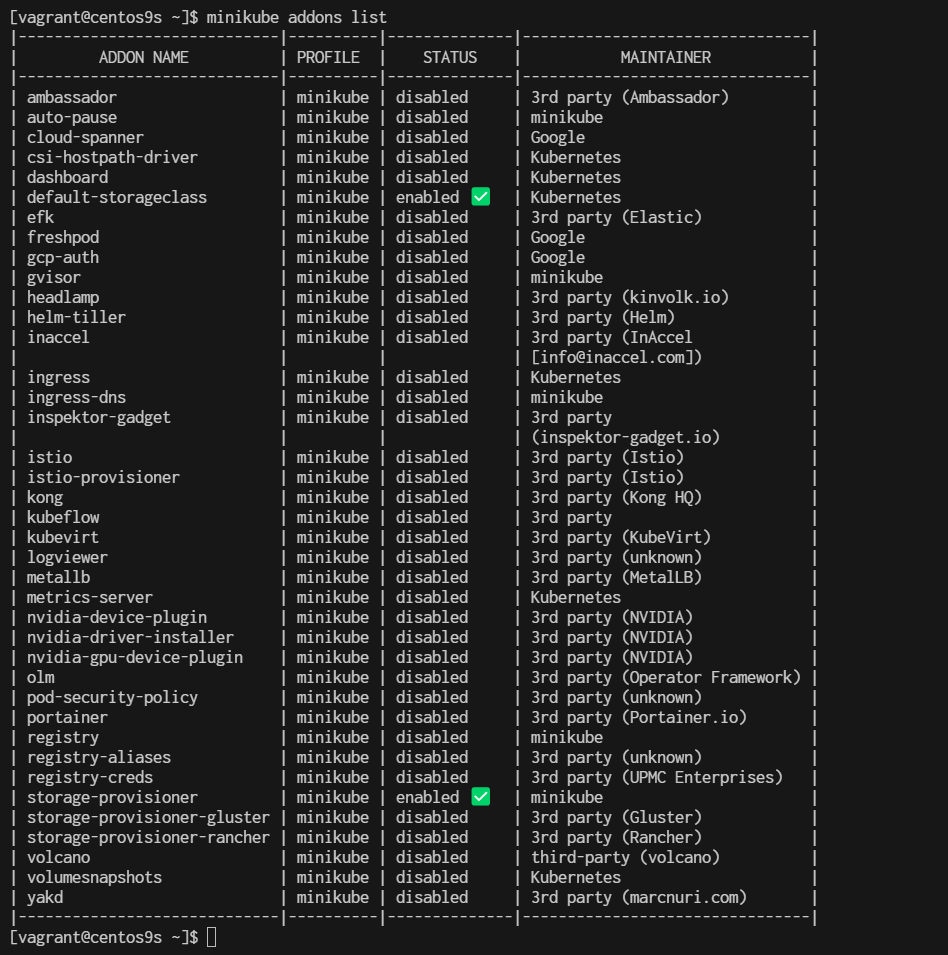

## To enable an addon use command ```minikube addons enable <addon-name>```

```
$ minikube addons enable ingress
```

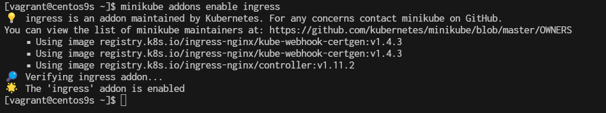

```
$ minikube addons enable matrics-server
```

## Install minikube on CentOs9 Stream: Accessing the  Kubernetes Dashboard

Enabling and Accessing Minikube Dashboard
Minikube dashboard is the Kubernetes dashboard. Using Kubernetes dashboard we can manage all resources within Kubernetes using web-based GUI instead of CLI. To enable Minikube dashboard, execute the following command:

```
$ minikube dashboard

🔌  Enabling dashboard ...
    ▪ Using image docker.io/kubernetesui/dashboard:v2.7.0
    ▪ Using image docker.io/kubernetesui/metrics-scraper:v1.0.8
💡  Some dashboard features require the metrics-server addon. To enable all features please run:

        minikube addons enable metrics-server

🤔  Verifying dashboard health ...
🚀  Launching proxy ...
🤔  Verifying proxy health ...

🎉  Opening http://127.0.0.1:34571/api/v1/namespaces/kubernetes-dashboard/services/http:kubernetes-dashboard:/proxy/ in your default browser...
👉  http://127.0.0.1:34571/api/v1/namespaces/kubernetes-dashboard/services/http:kubernetes-dashboard:/proxy/
```

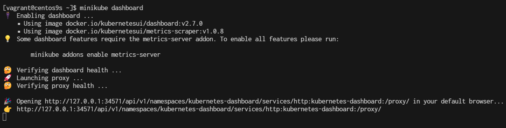

## open second terminal and test from terminal
The above command is enabling dashboard addon and directly set access to it. We can see from the command response, the dashboard is accessible through URL http://127.0.0.1:34571/api/v1/namespaces/kubernetes-dashboard/services/http:kubernetes-dashboard:/proxy/, but to access this link you have to remote your server desktop and open the link using web browser. But it is going to be a problem if your server is only installed with the command line interface (without desktop). By the way, to confirm that the dashboard is really running, you can use curl <link> from second terminal.

```
http://127.0.0.1:34571/api/v1/namespaces/kubernetes-dashboard/services/http:kubernetes-dashboard:/proxy/
```

press CTRL+C to exit

if we run minikube dashboard again minikube will start with random port
```
$ minikube dashboard
🤔  Verifying dashboard health ...
🚀  Launching proxy ...
🤔  Verifying proxy health ...
🎉  Opening http://127.0.0.1:42819/api/v1/namespaces/kubernetes-dashboard/services/http:kubernetes-dashboard:/proxy/ in your default browser...
👉  http://127.0.0.1:42819/api/v1/namespaces/kubernetes-dashboard/services/http:kubernetes-dashboard:/proxy/
```

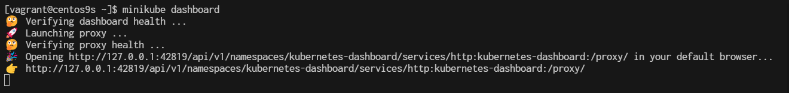

- this time port will change to 42819 (may difference from yours)

## Check add on again

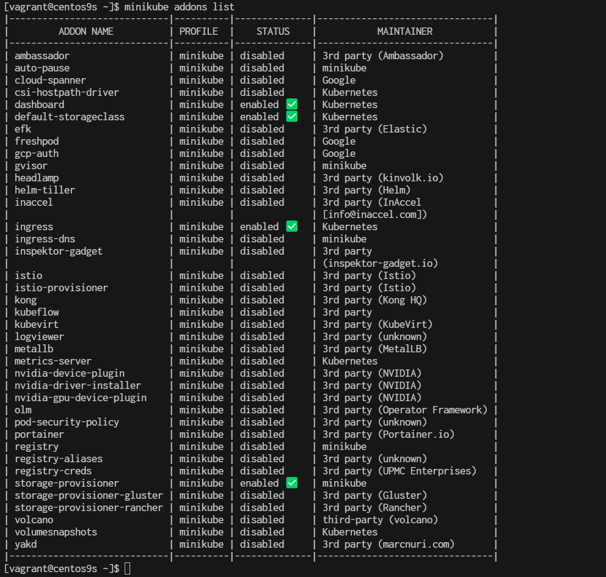


## Uses proxy to connect to dashboard
running command minikube dashboard will automatically run proxy to access the dashboard but with random port at the localhost (in the above example we get port number 42819). We know that the dashboard addon has been enabled and we just need a proxy to access it from a static port. Stop the dashboard proxy by pressing button CTRL + C / Command + C for Mac, after that type command kubectl proxy and press enter

```
$ kubectl proxy
Starting to serve on 127.0.0.1:8001
```
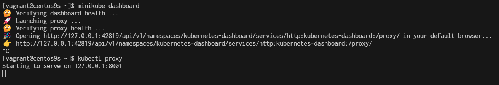

The Kubernetes APIs are now served through port 8001 (default port for Kubernetes API). Now your dashboard is accessible through port 8001 together with all Kubernetes APIs. The URL for the dashboard is now http://127.0.0.1:8001/api/v1/namespaces/kubernetes-dashboard/services/http:kubernetes-dashboard:/proxy/, but again this URL is only accessible by local access.

To access it remotely, you can utilize the SSH to your server, using -L option. Open terminal/command prompt on your local PC/laptop and type the following command:

`ssh -L 12345:localhost:8001 root@<ip-of-your-server>`

```
ssh -L 12345:localhost:8001 vagrant@192.168.40.10
```


Replace <ip-of-your-server> with your server IP, now you can access the dashboard remotely from your local browser using localhost / 127.0.0.1 at port 12345. The link for the dashboard is now ```http://localhost:12345/api/v1/namespaces/kubernetes-dashboard/services/http:kubernetes-dashboard:/proxy/```. Your local port 12345 will be tied up with the server at port 8001 as long as the SSH connection is connected. Following is the Kubernetes dashboard, accessed remotely from local machine.


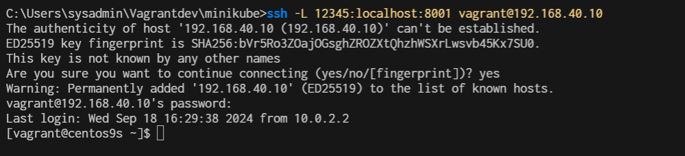

open browser from windows
[http://localhost:12345/api/v1/namespaces/kubernetes-dashboard/services/http:kubernetes-dashboard:/proxy/#/pod?namespace=_all](http://localhost:12345/api/v1/namespaces/kubernetes-dashboard/services/http:kubernetes-dashboard:/proxy/#/pod?namespace=_all)

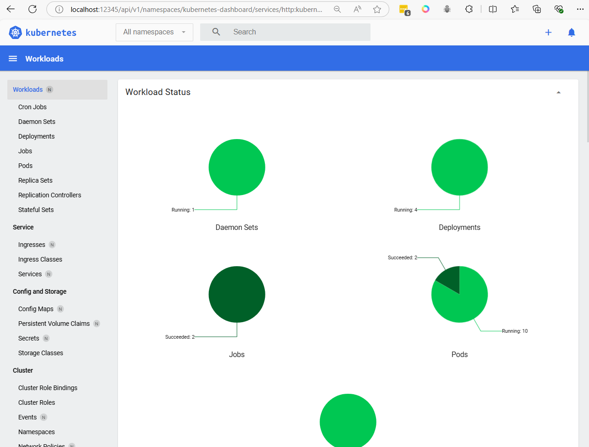

## Summary addon command
```
$ minikube addons list    // This will list available addons 
$ minikube addons enable dashboard   // It will enable k8s dashboard
$ minikube addons enable ingress     // It will enable ingress controller
$ minikube addons list | grep -i -E "dashboard|ingress"
```

## if you want to reset minikube.
```
$ minikube delete
$ rm -rf ~/.minikube
$ rm -rf ~/.kube

$ minikube start
```

