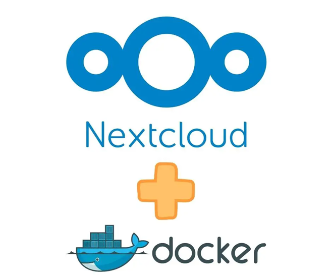
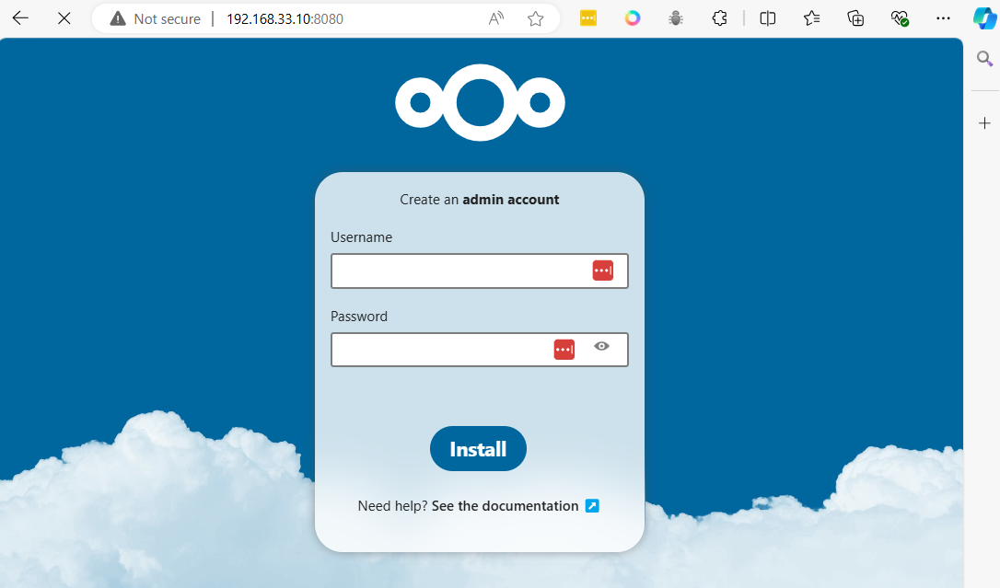

# NextCloud Container


```
cd ~
mkdir nextcloud
cd nextcloud 
```

```bash
cat <<EOF | tee docker-compose.yml
services:
  nextcloud_db:
    # This could be a specific version like mariadb:10.6
    image: mariadb
    restart: always
    command: --transaction-isolation=READ-COMMITTED --binlog-format=ROW
    networks:
      - cloudnet
    volumes:
      - db:/var/lib/mysql
    environment:
      - MYSQL_RANDOM_ROOT_PASSWORD=true
      - MYSQL_PASSWORD=PASSWORD
      - MYSQL_DATABASE=nextcloud
      - MYSQL_USER=nextcloud

  nextcloud:
    # This could be just 'nextcloud' to get the latest version
    image: nextcloud:28-apache
    restart: always
    networks:
      - cloudnet
    ports:
      - 8080:80
    volumes:
      - nextcloud:/var/www/html
    environment:
      - NEXTCLOUD_DATA_DIR=/var/www/html/data
      - MYSQL_PASSWORD=PASSWORD-as-above
      - MYSQL_DATABASE=nextcloud
      - MYSQL_USER=nextcloud
      - MYSQL_HOST=nextcloud_db

volumes:
   nextcloud:
   db:


networks:
  cloudnet:
    name: cloudnet
    driver: bridge
EOF
```



```
cat docker-compose.yml
```

```
docker compose up -d
```