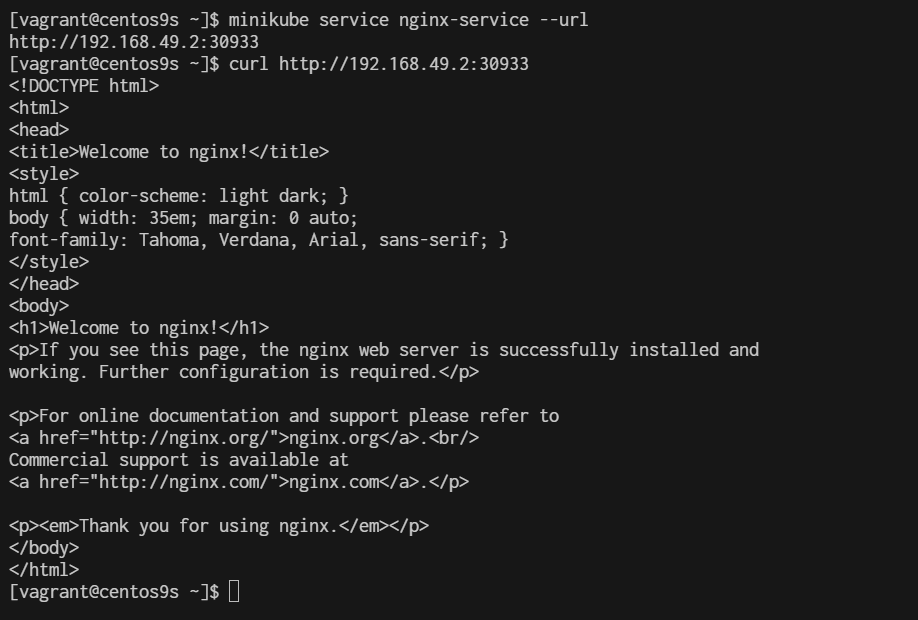

# workshop2 deploy nginx

## install nginx-pod
Using kubectl run:
```
$ kubectl run nginx-pod --image=nginx --restart=Never --port=80 -n default
pod/nginx-pod created
```

This command creates a pod named nginx-pod in default namespace using the Nginx Docker image. The --restart=Never flag indicates that it's a one-time job and won't be restarted automatically if it fails or stops.

```
$ kubectl get pods
NAME                         READY   STATUS              RESTARTS        AGE
nginx-pod                    0/1     ContainerCreating   0               33s
```
## Create nginx-service
Now pod is up and running let’s create a service to access application externally

Using kubectl run:

```
$ kubectl expose pod nginx-pod --type=NodePort --port=80 --name=nginx-service
service/nginx-service exposed
```

This command exposes the Nginx pod using a NodePort service, making it accessible externally on a specific port.

Verify the service is created using below command:

```
$ kubectl get svc
NAME            TYPE        CLUSTER-IP       EXTERNAL-IP   PORT(S)        AGE
kubernetes      ClusterIP   10.96.0.1        <none>        443/TCP        5h39m
nginx-service   NodePort    10.105.183.188   <none>        80:30933/TCP   60s
```
```
$ minikube ip
192.168.49.2

$ minikube service nginx-service --url
http://192.168.49.2:30933
```


