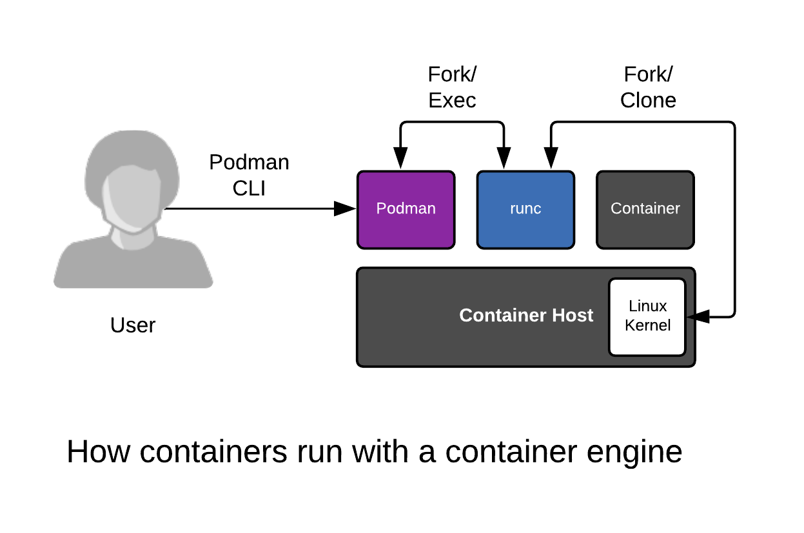
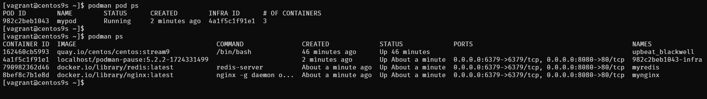
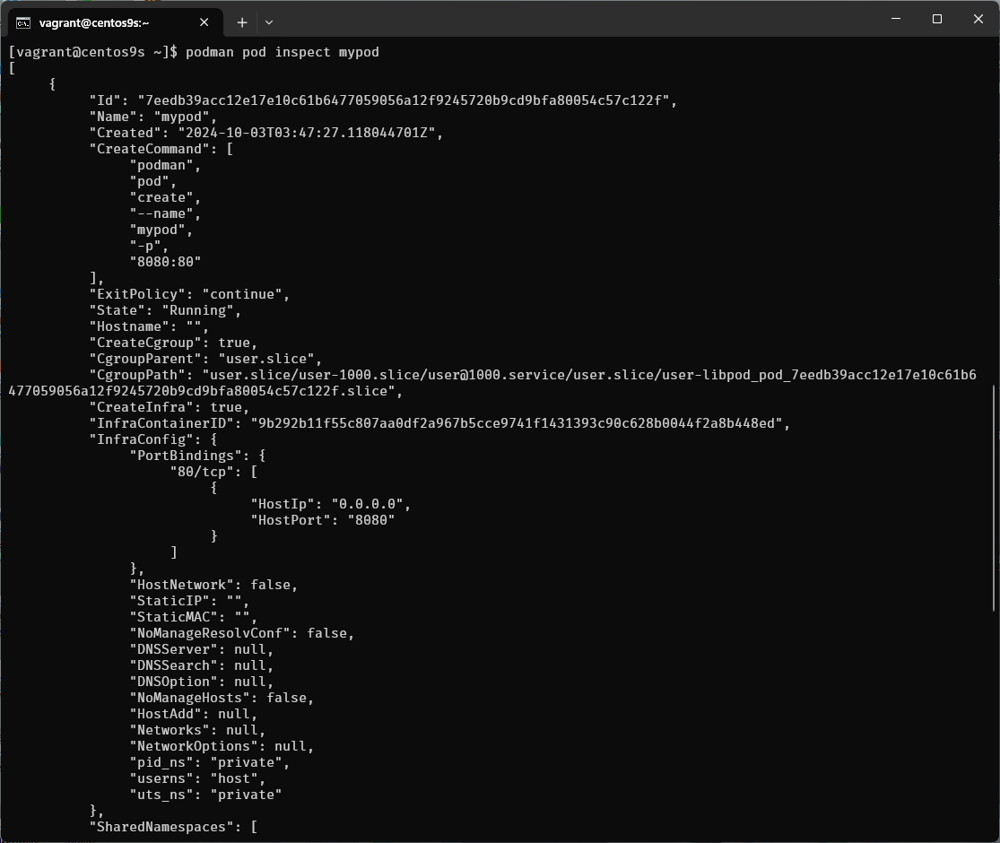
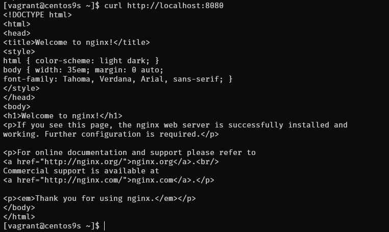
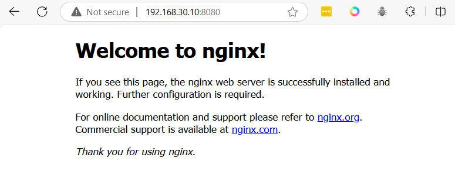
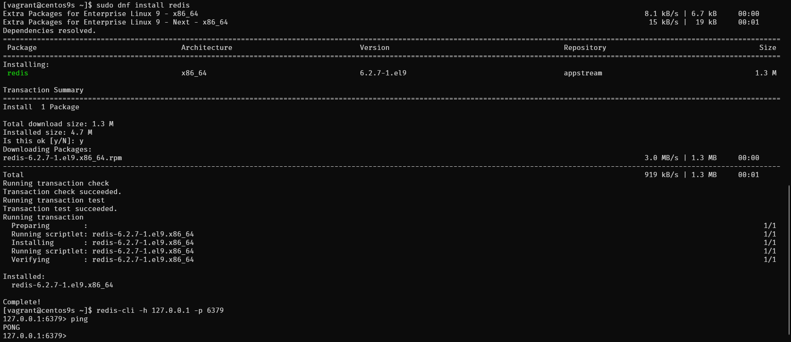

# Podman  & Pod Deployment



**Create project folder**
```
mkdir Podman
cd Podman
```

**Create Vagrantfile**  
- install podman
- open port 80, 8080, 6379 in firewall

- cpu 2 ram 4096

```
# -*- mode: ruby -*-
# vi: set ft=ruby :


$script=<<-SCRIPT
    sed -i 's/PasswordAuthentication no/PasswordAuthentication yes/g' /etc/ssh/sshd_config    
    sudo systemctl restart sshd.service
    sudo firewall-cmd --state
    sudo systemctl --enable --now firewalld
    sudo firewall-cmd --permanent --add-port=80/tcp
    sudo firewall-cmd --permanent --add-port=8080/tcp
    sudo firewall-cmd --permanent --add-port=6379/tcp
    sudo firewall-cmd --reload
    sudo firewall-cmd --list-all
    sudo dnf update -y
    sudo dnf install podman -y
SCRIPT

Vagrant.configure("2") do |config|

  config.vm.box = "generic/centos9s"

  config.vm.network "private_network", ip: "192.168.30.10"
  config.vm.synced_folder ".", "/vagrant"

  config.vm.provider "virtualbox" do |vb|
     vb.memory = "4096"
     vb.cpus = 2
  end

  config.vm.provision "shell", inline: $script
end
```

Start vm
```
vagrant up
```

ssh to VM
```
vagrant ssh
```

## 1. Install Podman on CentOS Stream 9 (skip)

```
sudo dnf update -y
sudo dnf install -y podman
```

## 2.  To confirm that Podman is installed correctly, check the version:

```
$ podman --version
podman version 5.2.2
```

Podman works similarly to Docker, but it doesn’t require a daemon to run containers and has better integration with rootless containers  

- **2.1 	Download an official image and create a Container and output the words**
```
$ podman pull centos:stream9

Resolved "centos" as an alias (/etc/containers/registries.conf.d/000-shortnames.conf)
Trying to pull quay.io/centos/centos:stream9...
Getting image source signatures
Copying blob da0e926b3d56 done   |
Copying config 088a066b40 done   |
Writing manifest to image destination
088a066b40b472b1fb270e23481df7b4e60840519d395d20e1fbef1e89558f1e

```

Run one time
```
$ podman run centos:stream9 /bin/echo "Welcome to the Podman"

Welcome to the Podman

$ podman ps -a

CONTAINER ID  IMAGE                          COMMAND               CREATED         STATUS                     PORTS       NAMES
ee576a0e185c  quay.io/centos/centos:stream9  /bin/echo Welcome...  52 seconds ago  Exited (0) 51 seconds ago              agitated_hellman

```

- **2.2 Connect to the interactive session of a Container with ```-it```**
```
$ podman run -it centos:stream9 /bin/bash

[root@d32cc72527ce /]# exit
```
- type exit

- **2.3  run a Container as a Daemon add -d**
```
$ podman run -itd centos:stream9 /bin/bash
162460cb5993b980ba4254cb0ad8b5931027ae754f2afb14650065038942523f
$ podman ps 

CONTAINER ID  IMAGE                          COMMAND     CREATED         STATUS         PORTS       NAMES
162460cb5993  quay.io/centos/centos:stream9  /bin/bash   12 seconds ago  Up 13 seconds              upbeat_blackwell
```

## 3. Working with Pods
In Podman, a pod can run multiple containers, and they share the same network namespace, allowing them to communicate easily via localhost. 


Step-by-Step Pod Deployment  
**- 3.1. Create a Pod**  
Pods in Podman are a group of one or more containers sharing networking and other resources. 

```
$ podman pod create --name mypod -p 6379:6379 -p 8080:80

7eedb39acc12e17e10c61b6477059056a12f9245720b9cd9bfa80054c57c122f

$ podman pod ls

POD ID        NAME        STATUS      CREATED         INFRA ID      # OF CONTAINERS
7eedb39acc12  mypod       Created     25 seconds ago  9b292b11f55c  1

```
This creates a pod named mypod with a port forward from 8080 on the host to 80 in the pod.


```admonish info
In Podman (as well as Kubernetes), the first container in a pod is called the infra container (sometimes referred to as the "pause container"). This container plays a crucial role in maintaining the shared namespaces for the pod, even though it doesn't run any significant application workload itself.
```

**Infra Container in Podman**  
In Podman, when you create a pod, an infra container is automatically created. You can see it when you inspect a pod. ```podman pod inspect <pod-name>```

```
$ podman pod inspect mypod
```


**- 3.2. Deploy a Container Inside the Pod**
Now let's deploy a container inside the pod. For example, we can deploy an Nginx container.

```
$ podman run -d --name mynginx --pod mypod docker.io/library/nginx:latest

Trying to pull docker.io/library/nginx:latest...
Getting image source signatures
Copying blob 97182578e5ec done   |
Copying blob 302e3ee49805 done   |
Copying blob 34a52cbc3961 done   |
Copying blob cd986b3703ae done   |
Copying blob d1875670ac8a done   |
Copying blob af17adb1bdcc done   |
Copying blob 67b9310357e1 done   |
Copying config 9527c0f683 done   |
Writing manifest to image destination
cc99c5baf935f9256e8bef6d903500c7002fe15c0fdbc70e5330f3d63b18e180

```
The --pod mypod flag specifies that the container should run inside the mypod pod.  

```
$ podman pod ls
POD ID        NAME        STATUS      CREATED        INFRA ID      # OF CONTAINERS
7eedb39acc12  mypod       Running     2 minutes ago  9b292b11f55c  2

```


**- 3.3. Add Another Container to the Same Pod**   
Now, add another container, such as a redis container.

```
$ podman run -d --name myredis --pod mypod docker.io/library/redis:latest

Trying to pull docker.io/library/redis:latest...
Getting image source signatures
Copying blob 302e3ee49805 skipped: already exists
Copying blob 96377887d476 done   |
Copying blob 4825c5e95815 done   |
Copying blob 5d0249d9189d done   |
Copying blob b0ce50685fa2 done   |
Copying blob 455886c7d31b done   |
Copying blob 4f4fb700ef54 done   |
Copying blob 5fac73c23c9b done   |
Copying config 7e49ed81b4 done   |
Writing manifest to image destination
33715d3e55b1d33df769818018de3579f7402d7a3dbc1c14cc86a5e3d7ebc8dc
```

```
$ podman pod ls
POD ID        NAME        STATUS      CREATED        INFRA ID      # OF CONTAINERS
7eedb39acc12  mypod       Running     3 minutes ago  9b292b11f55c  3
```

Now you have two containers (nginx and redis) running inside the same pod and sharing the same network namespace. You can access the Nginx service from localhost:8080 on your host.

**3.4. Summary Check Pod and Container Status**  
You can inspect the running pod and its containers using the following commands:

```
$ podman pod ps     # List all running pods
$ podman ps         # List all running containers
```




To view detailed information about the pod:
```
podman pod inspect mypod
```



```
$ curl http://localhost:8080
```



open browser  



Test redis

```
$ sudo dnf install redis
```

```
$ redis-cli -h 127.0.0.1 -p 6379
127.0.0.1:6379> ping
PONG
127.0.0.1:6379>
```



## 4. Managing Containers in a Pod

You can stop, start, or remove containers individually or manage the entire pod

**4.1. Stopping a Pod**    
To stop the entire pod (and all containers within it):

```
podman pod stop mypod
```

**4.2. Starting a Pod**   
To start the pod again:
```
podman pod start mypod
```

**4.3 Removing a Pod**  
To remove the pod and its containers:  
```
podman pod rm -f mypod
```