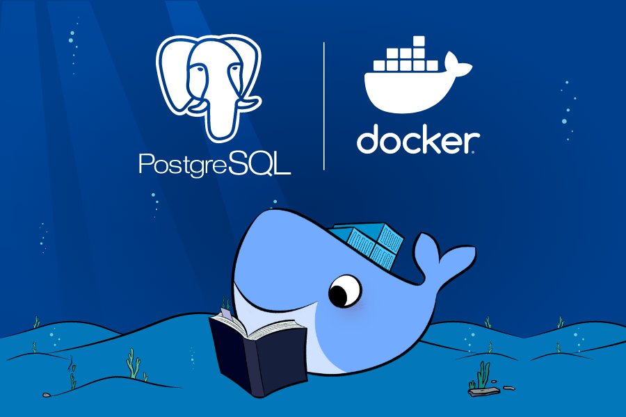
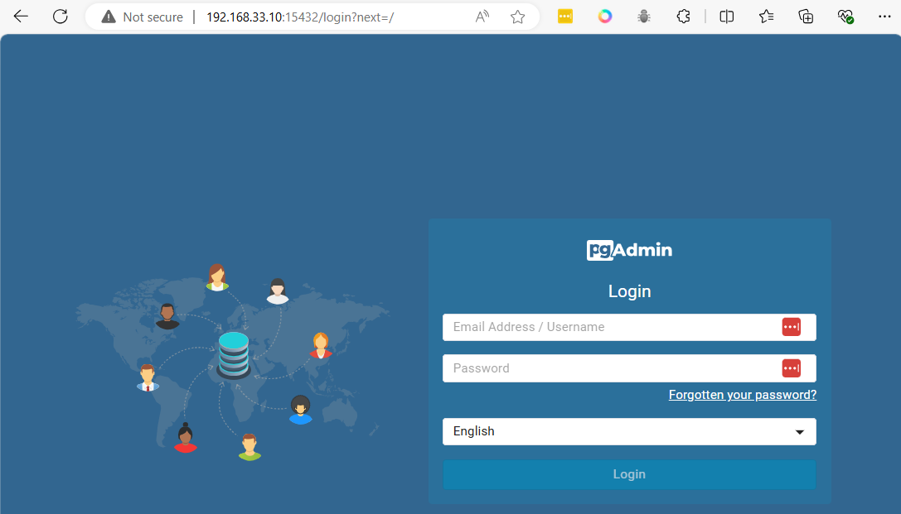
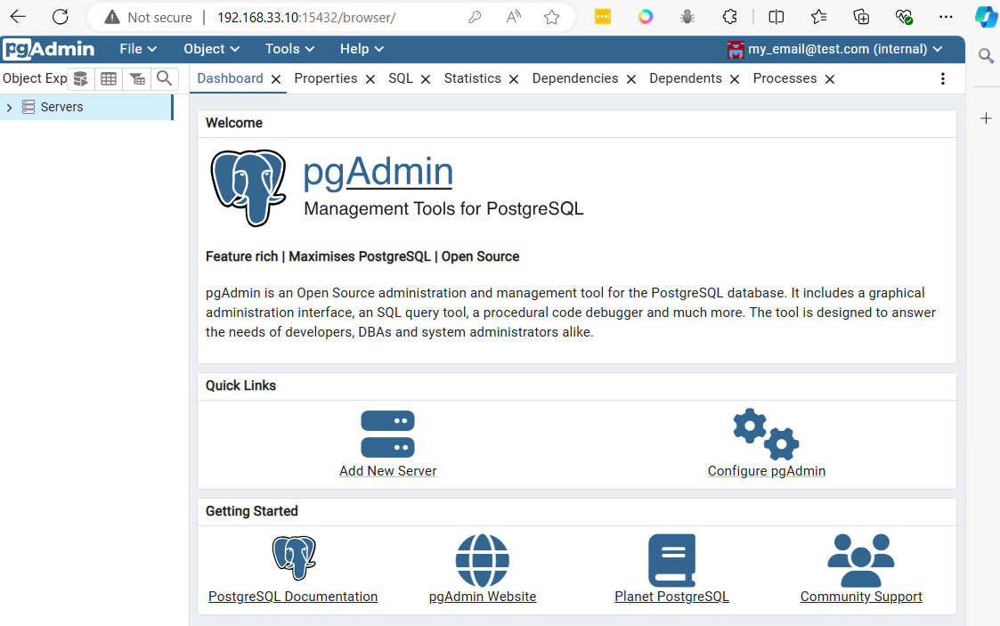
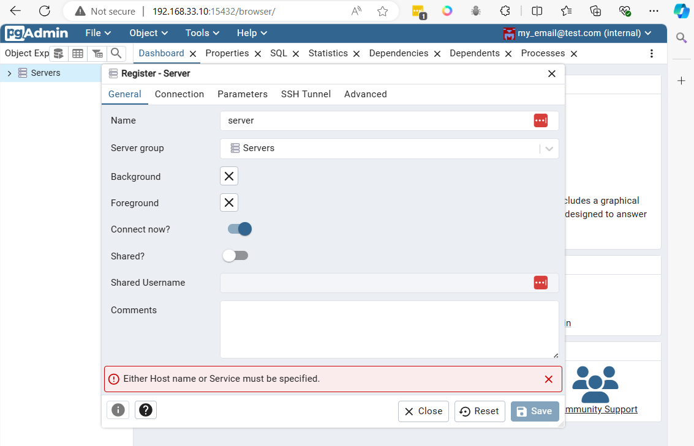
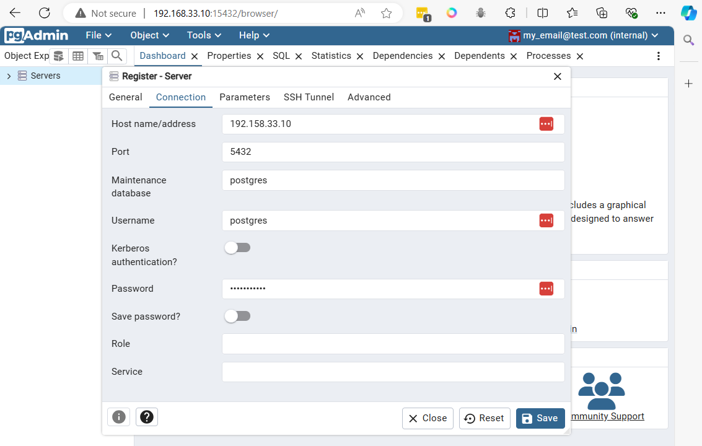
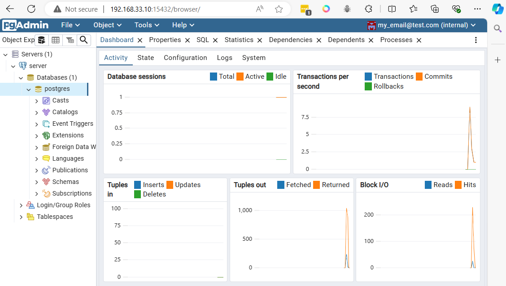
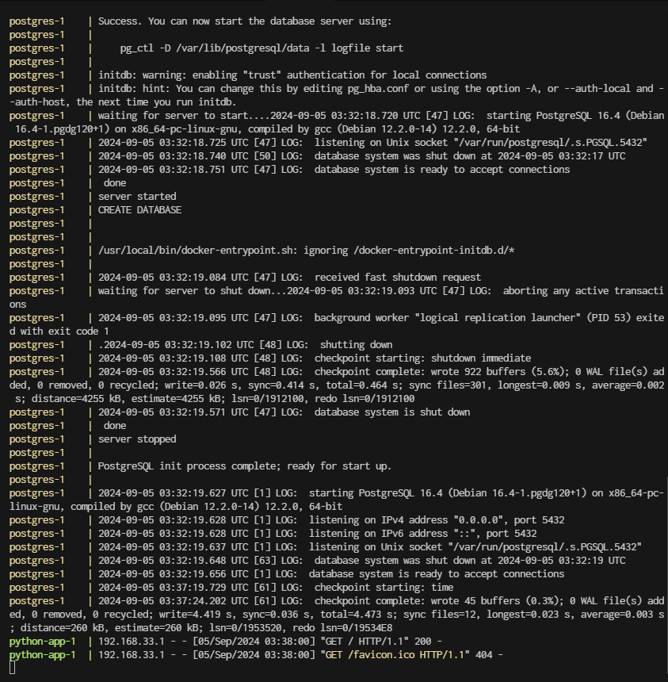
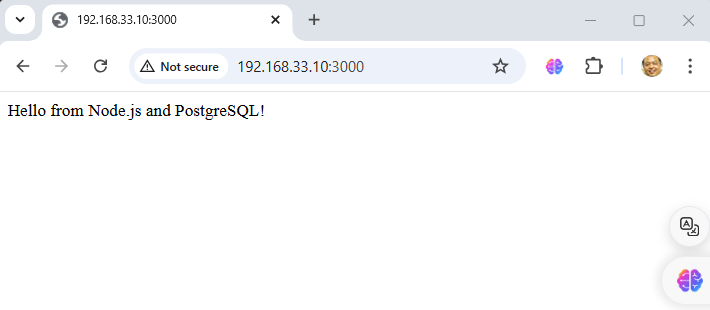
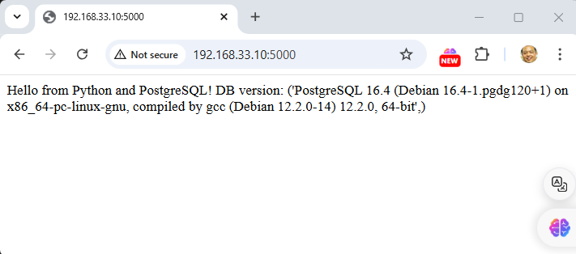
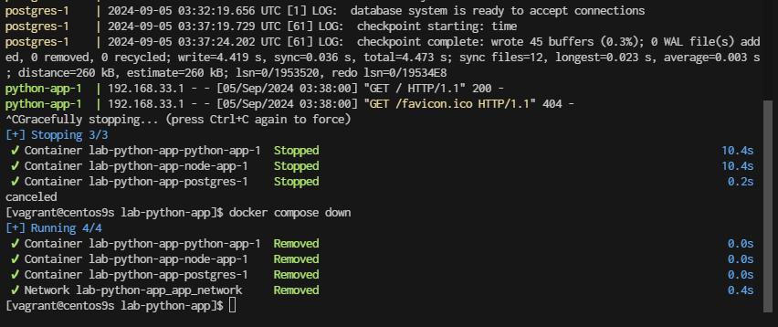

# Postgresql Container


- Step1  pull image [https://hub.docker.com/_/postgres/](https://hub.docker.com/_/postgres/)

```
$ docker pull postgres
```

- Step2 Run container
```
$ docker run --name my-postgres -e POSTGRES_PASSWORD=my_password -d -p 5432:5432 postgres
$ docker ps
```
- Explaination
    - my-postgres is the name of the container (you can choose a different name if you prefer).
    - my_password is the password you want to set for the “postgres” user in PostgreSQL.
    - The -d option runs the container in the background.
    - The -p 5432:5432 option maps port 5432 from the container to port 5432 on the host, allowing you to connect to PostgreSQL from the host.


- Step3 check port
```
$ docker port my-postgres
5432/tcp -> 0.0.0.0:5432
```

- Step4 Access point  
```
pull image postgres addmin
```

- Step 5 Run
```
docker run --name test-pgadmin -p 15432:80 -e "PGADMIN_DEFAULT_EMAIL=my_email@test.com" -e "PGADMIN_DEFAULT_PASSWORD=my_password" -d dpage/pgadmin4

```
- Explaination
    - **test-pgadmin** is the name of the container being created.
    - The **-p 15432:80** option maps port 15432, which is used for communication with pgAdmin, to port 80.
    - **PGADMIN_DEFAULT_EMAIL** will be the login you use to access pgAdmin.
    - **PGADMIN_DEFAULT_PASSWORD** will be the password you use to access pgAdmin.

- prepare firewall-cmd
```
sudo firewall-cmd --permanent --add-port=5432/tcp
sudo firewall-cmd --reload
```
access to dashboard  
```
http://192.168.33.10:15432/
```



After logging in with the defined email (my_email@test.com) and password (my_password), the main panel will appear










Connect to postgresql from vagrant command line

```
sudo ss -tulpn | grep 5432
```

```
sudo dnf install postgresql
```

connnect with command line
```
PGPASSWORD=my_password psql -h localhost -p 5432 -U postgres
// result
psql (13.16, server 16.4 (Debian 16.4-1.pgdg120+1))
WARNING: psql major version 13, server major version 16.
         Some psql features might not work.
Type "help" for help.

postgres=# \q
```

```
$ PGPASSWORD=my_password psql -h localhost -p 5432 -U postgres -c '\l'
                                 List of databases
   Name    |  Owner   | Encoding |  Collate   |   Ctype    |   Access privileges
-----------+----------+----------+------------+------------+-----------------------
 postgres  | postgres | UTF8     | en_US.utf8 | en_US.utf8 |
 template0 | postgres | UTF8     | en_US.utf8 | en_US.utf8 | =c/postgres          +
           |          |          |            |            | postgres=CTc/postgres
 template1 | postgres | UTF8     | en_US.utf8 | en_US.utf8 | =c/postgres          +
           |          |          |            |            | postgres=CTc/postgres
(3 rows)
```

- Clean all 
```
$ docker stop $(docker ps -q)
$ docker rm $(docker ps -a -q)
```
> 

## Create Dockerfile
```
$ mkdir postgresq
$ cd postgres

$ cat <<EOF | tee docker-compose.yml
services:
  postgres:
    image: postgres
    environment:
      POSTGRES_PASSWORD: my_password
    ports:
      - "5432:5432"
    volumes:
      - pgdata:/var/lib/postgresql/data
    networks:
      - pg_network
    
  pgadmin:
    image: dpage/pgadmin4
    environment:
      PGADMIN_DEFAULT_EMAIL: my_email@test.com
      PGADMIN_DEFAULT_PASSWORD: my_password
    ports:
      - "15432:80"
    networks:
      - pg_network

networks:
  pg_network:

volumes:
  pgdata:
EOF
```

```
$ cat docker-compose.yml
```

- Docker compose
```
$ docker compose up -d
[+] Running 4/4
 ✔ Network postgres_default       Created                                                    0.5s
 ✔ Volume "postgres_pgdata"       Created                                                    0.0s
 ✔ Container postgres-postgres-1  Started                                                    0.5s
 ✔ Container postgres-pgadmin-1   Started                                                    0.5s
```

- Clean
```
$ docker stop $(docker ps -q)
$ docker rm $(docker ps -a -q)
```

>

## Containerize Application

Application structure
```
.
├── docker-compose.yml
├── node-app
│   ├── Dockerfile
│   ├── app.js
│   ├── package.json
└── python-app
    ├── Dockerfile
    └── app.py
```

create application
```
cd ~
mkdir lab-python-app
cd lab-python-app
mkdir {node-app,python-app}
```

-copy paste code below to terminal:
create file: docker-compose.yml
```bash
cat <<EOF | tee docker-compose.yml
services:
  postgres:
    image: postgres
    environment:
      POSTGRES_USER: my_user
      POSTGRES_PASSWORD: my_password
      POSTGRES_DB: my_database
    ports:
      - "5432:5432"
    volumes:
      - pgdata:/var/lib/postgresql/data
    networks:
      - app_network

  node-app:
    build: ./node-app
    environment:
      DB_HOST: postgres
      DB_USER: my_user
      DB_PASSWORD: my_password
      DB_NAME: my_database
    depends_on:
      - postgres
    ports:
      - "3000:3000"
    networks:
      - app_network

  python-app:
    build: ./python-app
    environment:
      DB_HOST: postgres
      DB_USER: my_user
      DB_PASSWORD: my_password
      DB_NAME: my_database
    depends_on:
      - postgres
    ports:
      - "5000:5000"
    networks:
      - app_network

networks:
  app_network:

volumes:
  pgdata:
EOF
```
-copy paste code below to terminal:
create file: node-app/Dockerfile
```bash
cat <<EOF  | tee node-app/Dockerfile
FROM node:22

WORKDIR /usr/src/app

COPY package*.json ./
RUN npm install

COPY . .

EXPOSE 3000

CMD ["node", "app.js"]
EOF
```
-copy paste code below to terminal:
create file: node-app/app.js
```bash
cat <<EOF  | tee node-app/app.js
const { Client } = require('pg');

const client = new Client({
  host: process.env.DB_HOST,
  user: process.env.DB_USER,
  password: process.env.DB_PASSWORD,
  database: process.env.DB_NAME,
});

client.connect()
  .then(() => console.log('Connected to PostgreSQL from Node.js!'))
  .catch(err => console.error('Connection error', err.stack));

const express = require('express');
const app = express();
const port = 3000;

app.get('/', (req, res) => {
  res.send('Hello from Node.js and PostgreSQL!');
});

app.listen(port, () => {
  console.log(`Node.js app listening at http://localhost:${port}`);
});

EOF
```
-copy paste code below to terminal:
create file: node-app/package.json
```bash
cat <<EOF | tee node-app/package.json
{
  "name": "node-app",
  "version": "1.0.0",
  "description": "A simple Node.js app with PostgreSQL",
  "main": "app.js",
  "scripts": {
    "start": "node app.js"
  },
  "dependencies": {
    "express": "^4.17.1",
    "pg": "^8.7.1"
  }
}
EOF
```

-copy paste code below to terminal:
create file: python-app/Dockerfile
```bash
cat <<EOF | tee python-app/Dockerfile

FROM python:3.12

WORKDIR /usr/src/app

COPY requirements.txt ./
RUN pip install --no-cache-dir -r requirements.txt

COPY . .

EXPOSE 5000

CMD ["python", "./app.py"]

EOF
```
-copy paste code below to terminal:
create file: python-app/requirements.txt
```bash
cat <<EOF | tee python-app/requirements.txt
flask
psycopg2
EOF
```
-copy paste code below to terminal:
create file: python-app/app.py
```bash
cat <<EOF | tee python-app/app.py
from flask import Flask
import psycopg2
import os

app = Flask(__name__)

def connect_db():
    conn = psycopg2.connect(
        host=os.getenv("DB_HOST"),
        database=os.getenv("DB_NAME"),
        user=os.getenv("DB_USER"),
        password=os.getenv("DB_PASSWORD")
    )
    return conn

@app.route('/')
def hello():
    try:
        conn = connect_db()
        cursor = conn.cursor()
        cursor.execute('SELECT version()')
        db_version = cursor.fetchone()
        cursor.close()
        conn.close()
        return f"Hello from Python and PostgreSQL! DB version: {db_version}"
    except Exception as e:
        return str(e)

if __name__ == '__main__':
    app.run(host='0.0.0.0', port=5000)
EOF
```

Steps to Run:
Build and run the services:

```
docker compose up --build
```

## Command Usage:

- **docker-compose up --build**: This command builds the images and starts the containers. It’s useful when you’ve made changes to your Dockerfiles or the application code, and you need to rebuild the images.

- **docker-compose up -d**: This command starts the containers in detached mode (background) using the existing images. If you have made changes and want to ensure the latest images are used, you should run docker-compose up --build first. After the initial build, subsequent runs with docker-compose up -d will use the existing images unless the Dockerfile or docker-compose.yml file changes.



Access the applications:

Node.js app will be running at [http://localhost:3000](http://localhost:3000)  

Python app will be running at [http://localhost:5000](http://localhost:5000)


Both applications will connect to the PostgreSQL database using the same credentials.

- Stop application
go back to console
- control + c to stop
- run ```docker compose down```

