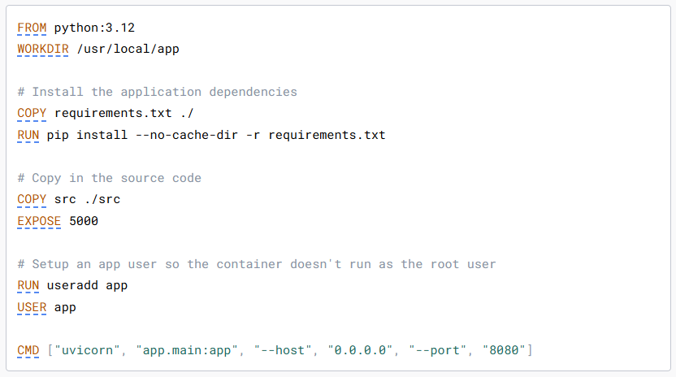
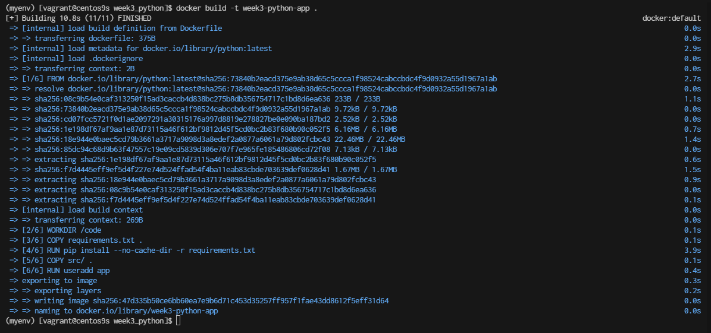
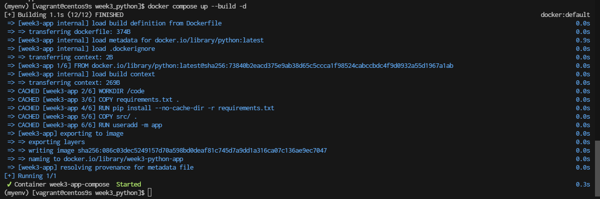
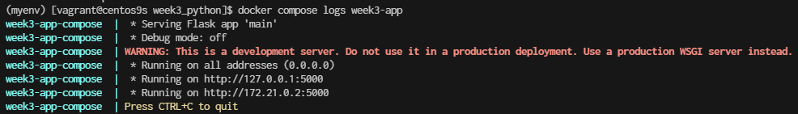
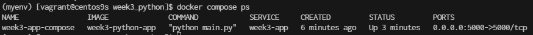
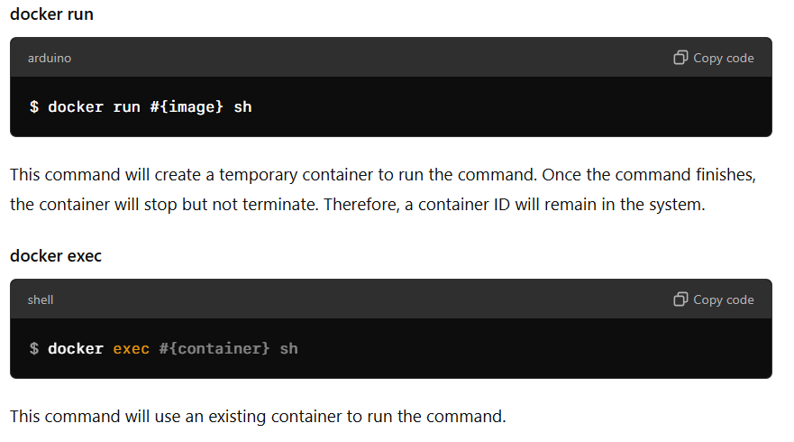

# python project


Common instructions
Some of the most common instructions in a Dockerfile include:

- ```FROM <image>``` - this specifies the base image that the build will extend.
- ```WORKDIR <path>``` - this instruction specifies the "working directory" or the path in the image where files will be copied and commands will be executed.
- ```COPY <host-path> <image-path>``` - this instruction tells the builder to copy files from the host and put them into the container image.
- ```RUN <command>``` - this instruction tells the builder to run the specified command.
- ```ENV <name> <value>``` - this instruction sets an environment variable that a running container will use.
- ```EXPOSE <port-number>``` - this instruction sets configuration on the image that indicates a port the image would like to expose.
- ```USER <user-or-uid>``` - this instruction sets the default user for all subsequent instructions.
- ```CMD ["<command>", "<arg1>"]``` - this instruction sets the default command a container using this image will run.

>
## vagrant ssh to vim
```
vagrant ssh
```

## check install python, pip
```
python --version
sudo dnf install python-pip
sudo dnf install tree
```

## Create project
```
$ cd
$ mkdir week3_python
$ cd week3_python
$ mkdir src


$ python -m venv myenv

$ source  myenv/bin/activate
(myenv) $ pip install  flask

(myenv) $ pip freeze >> requirements.txt
(myenv) $ cat requirements.txt
```

- Create main.py
```bash
cat <<EOF | tee src/main.py
from flask import Flask
server = Flask(__name__)
 
@server.route("/")
def index():
     return "Hello World!"
 
if __name__ == "__main__":
    server.run(host='0.0.0.0')
EOF
```

- Test Application
```
(myenv) $ python src/main.py
```
Result:
```
 * Serving Flask app 'main'
 * Debug mode: off
WARNING: This is a development server. Do not use it in a production deployment. Use a production WSGI server instead.
 * Running on all addresses (0.0.0.0)
 * Running on http://127.0.0.1:5000
 * Running on http://10.0.2.15:5000
Press CTRL+C to quit
```
Exit project by CTRL+C

- Exit from python development
```
(myenv) $ deactivate
```

- Create Dockerfile with python image
[https://hub.docker.com/_/python](https://hub.docker.com/_/python)
```bash
cat <<EOF  | tee Dockerfile
FROM python
WORKDIR /code 
COPY requirements.txt . 
RUN pip install --no-cache-dir -r requirements.txt

# Copy in the source code
COPY src/ .
EXPOSE 5000

# Setup an app user so the container doesn't run as the root user
RUN useradd -m app
USER app

CMD ["python", "main.py"]
EOF
```


- Project Structure
```
$ tree -L 2 .
.
├── Dockerfile
├── myenv
│   ├── bin
│   ├── include
│   ├── lib
│   ├── lib64 -> lib
│   └── pyvenv.cfg
├── requirements.txt
└── src
    └── main.py
```
- Create Image
```
docker build -t week3-python-app .
```



- Check image
```
$ docker images
```

```
$ docker run -it week3-python-app bash 
app@12ec39dcd0fc:/code$ ls
main.py  requirements.txt
```

- Run docker container
```
$ docker run -d -p 5000:5000 --name week3-app week3-python-app
f9bb95ba424167586ad36d54a8b7a9bfc643e6515efb8328d915c84584914c74


$ ss -tulpn | grep 5000
tcp   LISTEN 0      4096         0.0.0.0:5000      0.0.0.0:*
```

- monitor log
```
$ docker logs week3-app
```
Result:
```
 * Serving Flask app 'main'
 * Debug mode: off
WARNING: This is a development server. Do not use it in a production deployment. Use a production WSGI server instead.
 * Running on all addresses (0.0.0.0)
 * Running on http://127.0.0.1:5000
 * Running on http://172.17.0.2:5000
Press CTRL+C to quit
```

- stop container
```
$ docker container stop wee3-app
$ docker rm week3-app
```

- Create Docker compose
```
cat <<EOF | tee docker-compose.yml
services:
  week3-app:
    container_name: week3-app-compose
    image: myreponame/week3-python-app:latest
    ports:
      - "5000:5000"
    build:
      context: .
      dockerfile: Dockerfile
EOF
```


- Verify Build and Run:  
Make sure the Dockerfile builds successfully by running:
```
docker compose up --build -d
```


- Check Logs: with service name. if container stops
```
$ docker compose logs week3-app
```


- list docker compose
```
$ docker compose ps
```


- Delete images
```
$ docker rmi week3-python-app:latest
```
## Compare Run and Exec


- Stop Docker compose  before process
```
$ docker compose down
```
## Run another python App
```
cat <<EOF | tee src/main2.py
from flask import Flask, request, jsonify

app = Flask(__name__)

@app.route("/greet", methods=["GET"])
def greet():
    return "Hello! Welcome to the API."

@app.route("/echo", methods=["POST"])
def echo():
    data = request.get_json()
    return jsonify(data)

@app.route("/hello/<name>", methods=["GET"])
def hello(name):
    return f"Hello, {name}!"

if __name__ == "__main__":
    app.run(host='0.0.0.0', port=5000)
EOF
```

- enable firewall port 5000
```
sudo firewall-cmd --permanent --add-port=5000/tcp
sudo firewall-cmd --reload
```

```
$ python src/main2.py
```

1 Test
```
curl http://192.168.33.10:5000/greet
Hello! Welcome to the API.
```
2 Test
```
curl -X POST http://192.168.33.10:5000/echo -H "Content-Type: application/json" -d '{"key": "1234"}'
```
