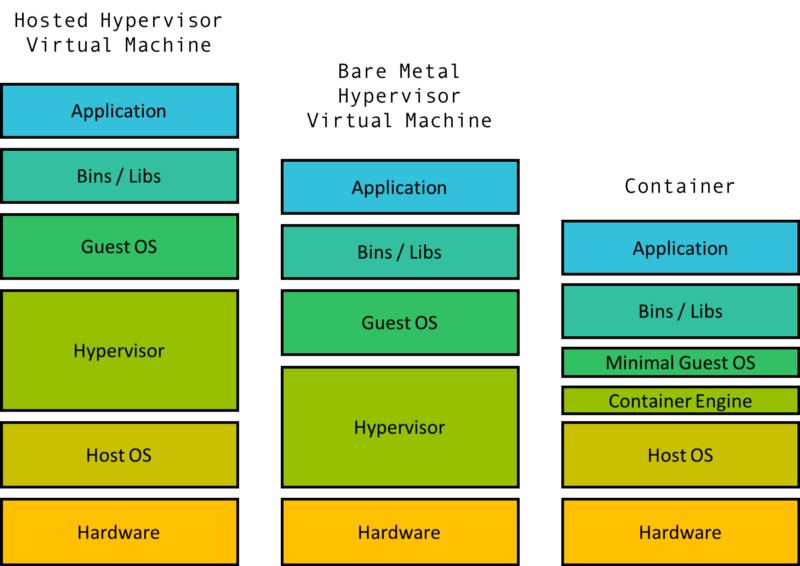
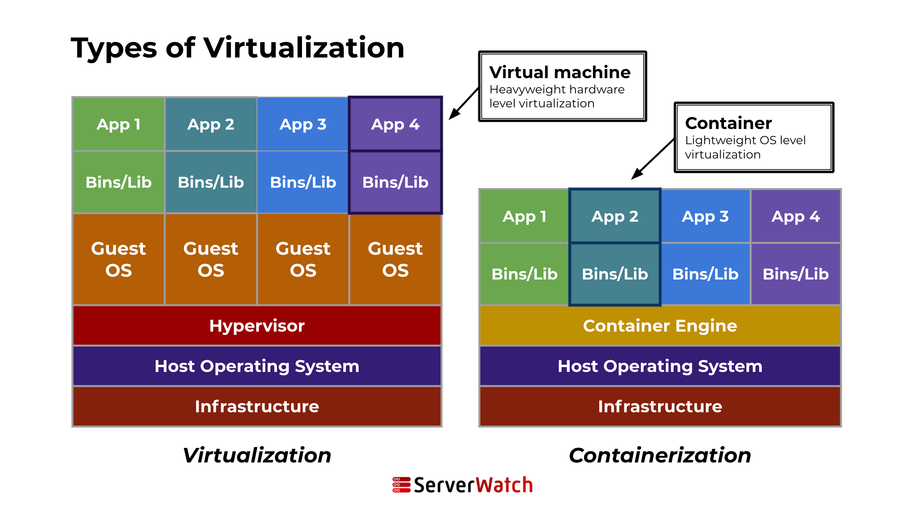
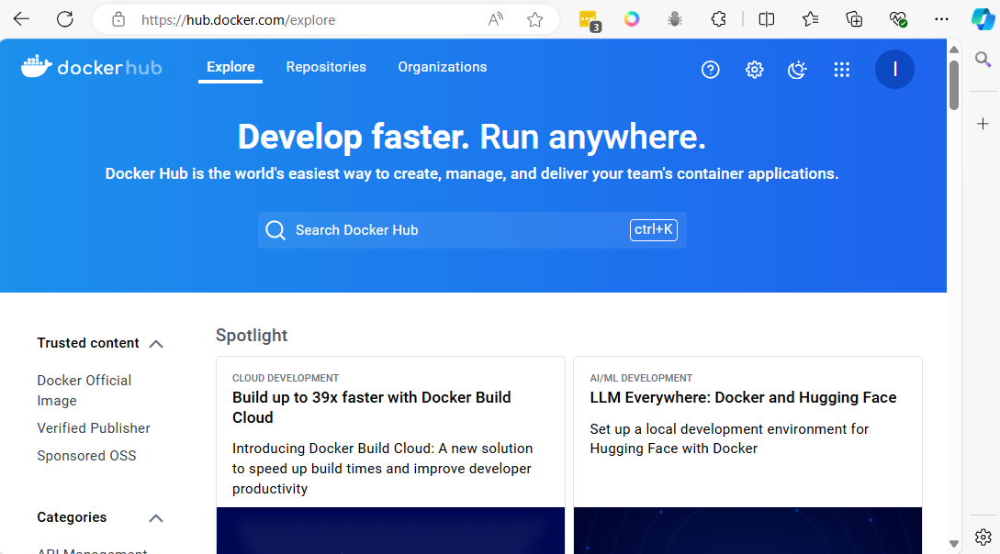

# Containers Technology

A container is a lightweight, standalone, executable package of software that includes everything needed to run a piece of software: code, runtime, system tools, system libraries, and settings. This technology is part of a broader trend known as containerization, a method of packaging software so it can be run with its dependencies isolated from other processes.

Containers allow developers to package and run applications in isolated environments, a process known as containerization. This technology provides a consistent and efficient means of deploying software across different environments, from a developer’s local workstation to production servers, without worrying about differences in OS configurations and underlying infrastructure.

Unlike traditional deployment methods, containers encapsulate an application and its dependencies in a container image. This image includes everything the application needs to run: code, runtime, libraries, and system tools. Because containers share the host system’s kernel (but maintain their own filesystem, CPU, memory, and process space), they are much lighter and more resource-efficient than virtual machines.

Key components of a container

## Several key components make up a container:

1 **Container engine:** This is the core software that provides a runtime environment for containers. Examples include Docker and rkt. The engine creates, runs, and manages the lifecycle of containers.  
2 **Container image:** This is a static file that includes all the components needed to run an application — code, runtime, system tools, libraries, and settings.  
3 **Registry:** This is a storage and content delivery system, holding container images. Users can pull images from a registry to deploy containers.  
4 **Orchestration tools:** These are tools for managing multiple containers. They help automate the deployment, scaling, and operations of containerized applications.   Kubernetes is a prime example of an orchestration tool.  
5 **Namespaces and cgroups:** These Linux features are used to isolate containers. Namespaces ensure that each container has its own isolated workspace (including file system, network stack, etc.), and cgroups manage resource allocation (CPU, memory, disk I/O, etc.) to each container.  
6 **Docker Hub:** A cloud-based registry service for sharing and managing container images.   [https://hub.docker.com/](https://hub.docker.com/)

7 **Docker Compose:** A tool for defining and running multi-container Docker applications.

