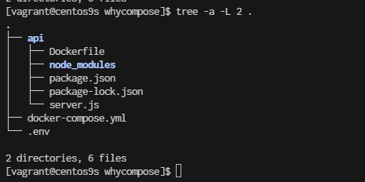
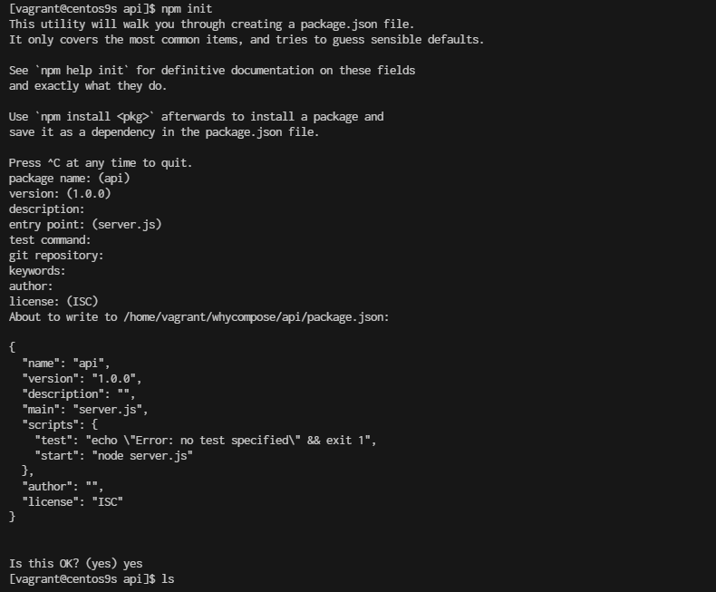
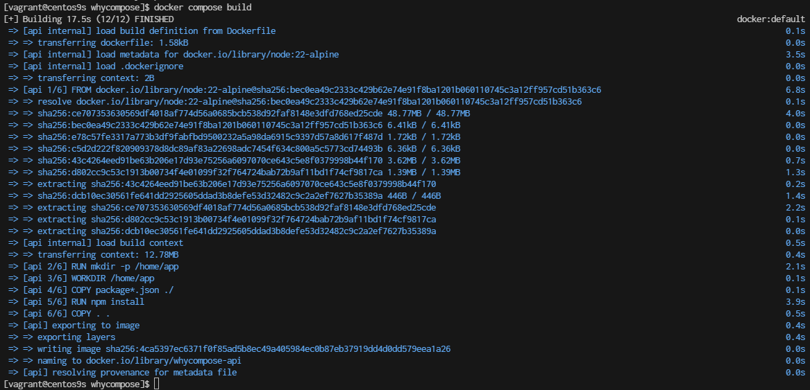

# Why Docker Compose


- Structure Folder
```
cd 
mkdir whycompose
cd whycompose
mkdir api
cd api
npm init 
```



- Create project
    - create file server.js
```
vim server.js
```
```
const express = require('express');
const cors = require('cors');
const { MongoClient } = require('mongodb');
const bodyParser = require('body-parser');
const app = express();

const mongoClientOptions = { useNewUrlParser: true, useUnifiedTopology: true };
const databaseName = 'my-db';
const port = 3000;

app.use(cors());
app.use(bodyParser.urlencoded({ extended: true }));
app.use(bodyParser.json());

app.post('/add-user', async (req, res) => {
  const userObj = req.body;
  const dbUrl = process.env.DB_URL;

  try {
    const client = await MongoClient.connect(dbUrl, mongoClientOptions);
    const db = client.db(databaseName);

    // Define the newvalues object with $set operator
    const newvalues = { $set: userObj };

    // Update or insert the document
    const result = await db.collection('users').updateOne(
      { userName: userObj.userName }, // Query to find the document
      newvalues, // Update the document
      { upsert: true } // Create the document if it does not exist
    );

    client.close();

    // Send success response
    res.status(200).json({ message: 'User updated or added successfully', result });
  } catch (err) {
    console.error('Error updating user:', err);
    res.status(500).send('Internal Server Error');
  }
});

app.get('/get-user', async (req, res) => {
  const query = req.query;
  const dbUrl = process.env.DB_URL;

  try {
    const client = await MongoClient.connect(dbUrl, mongoClientOptions);
    const db = client.db(databaseName);

    const result = await db.collection('users').findOne(query);
    client.close();

    // Send user data or empty object
    res.status(200).json(result || {});
  } catch (err) {
    console.error('Error fetching user:', err);
    res.status(500).send('Internal Server Error');
  }
});

app.listen(port, () => {
  console.log(`App listening on port ${port}!`);
});

```

## Install the Required Packages
Next, you'll need to install the required npm packages. Based on your server.js file, you need the following packages:

- express: A web framework for Node.js.
- cors: A package for enabling Cross-Origin Resource Sharing (CORS).
- mongodb: The MongoDB driver for Node.js.
- body-parser: Middleware for parsing request bodies.

```
$ npm install express cors mongodb body-parser
```

- Create Dockerfile
```js
cat <<EOF | tee Dockerfile
FROM node:22-alpine
# Import a Nodejs image that runs on top of an Alpine image.
 
RUN mkdir -p /home/app
# This command will create a subdirectory called /app in the /home directory of the Alpine image
 
WORKDIR /home/app
# This command will set the default directory as /home/app.
# Hence, the next commands will start executing from the /home/app directory of the Alpine image. 
 
COPY package*.json ./
# To copy both package.json and package-lock.json to the working directory (/home/app) of the Alpine image.
# Prior to copying the entire current working directory, we copy the package.json file to the working directory (/home/app) of the Alpine image. This allows to take advantage of any cached layers.

RUN npm install
# This will create a node_modules folder in /home/app and
# install all the dependencies specified in the package.json file.
 
COPY . .
# Here “.” represents the current working directory.
# This command will copy all the files in the current directory to the working directory (/home/app) of the Alpine image.
 
EXPOSE 3000
# Make the application available on port 3000. By doing this, you can access the Nodejs application via port 3000.
 
CMD ["npm", "start"]
# One important thing to notice here is that “RUN” executes while the image creation process is running
# and “CMD” executes only after the image creation process is finished.
# One Dockerfile may consist of more than one "RUN" command, but it can only consist of one "CMD" command.
EOF
```

- create .cokerignore
```
cat <<EOF | tee .dockerignore
node_modules
EOF
```


## Go back to whycompose
```
cd whycompose
```

- create docker-compose.yml
```
cat <<EOF | tee docker-compose.yml
services:
  api:
    build:
      context: ./api
      dockerfile: Dockerfile
    ports:
      - "3000:3000"
    environment:
      DB_URL: ${DB_URL}
    networks:
      - my-network
    depends_on:
      - mongodb
    healthcheck:
      test: ["CMD-SHELL", "curl -f http://localhost:3000/health || exit 1"]
      interval: 30s
      retries: 3
      start_period: 30s
      timeout: 10s
    restart: unless-stopped

  mongodb:
    image: mongo:latest
    ports:
      - "27017:27017"
    environment:
      MONGO_INITDB_ROOT_USERNAME: ${MONGO_INITDB_ROOT_USERNAME}
      MONGO_INITDB_ROOT_PASSWORD: ${MONGO_INITDB_ROOT_PASSWORD}
    volumes:
      - mongo-data:/data/db
    networks:
      - my-network
    healthcheck:
      test: ["CMD-SHELL", "mongo --eval 'db.runCommand({ connectionStatus: 1 })' || exit 1"]
      interval: 30s
      retries: 3
      start_period: 30s
      timeout: 10s
    restart: unless-stopped

volumes:
  mongo-data:
    driver: local

networks:
  my-network:
    driver: bridge

EOF
```

## Understand: docker compose

- build Configuration:
    - Explicitly define context and dockerfile in the build section for clarity.
- Environment Variables:
    - Use the : syntax for environment variables which is more readable and aligns with docker-compose conventions.
- Health Checks:
    - Updated the health checks to ensure both services are properly monitored. The api service now checks a /health endpoint to verify it's up and running, while the mongodb service checks the connection status.
- Dependencies:
    - Added depends_on to the api service to ensure MongoDB starts before the API service. Note: depends_on does not wait for MongoDB to be "ready" but ensures it starts before the API.
- Restart Policy:
    - Added restart: unless-stopped to ensure services are automatically restarted unless explicitly stopped. This is useful for resilience.
- Networking:
    - Defined a custom network my-network with the bridge driver for better isolation and management of network traffic.


## Additional Considerations:

- .env File: Ensure your .env file is in place with appropriate variables:

```
cat <<EOF | tee .env
DB_URL=mongodb://mongodb:27017/mydatabase
MONGO_INITDB_ROOT_USERNAME=yourusername
MONGO_INITDB_ROOT_PASSWORD=yourpassword
EOF
```

- Dockerfile for API: Make sure your Dockerfile in the ./api directory is properly set up for building your application.

- Security: Be cautious with sensitive information and consider using secrets management tools for production environments.

- Volume Management: Regularly monitor and manage your volumes to avoid excessive disk usage.


- Build the Docker image
```
whycompose]$ docker compose build --no-cache
```

- Check docker image
```
whycompose]$ docker images
REPOSITORY                  TAG         IMAGE ID       CREATED         SIZE
whycompose-api              latest      4ca5397ec637   2 minutes ago   181MB
```

- Docker compose up
```
whycompose]$ docker compose up
```

# Summary docker command

When using Docker Compose and you want to force a rebuild of your services, even if Docker thinks the current images are up-to-date, you can use several options. These methods ensure that Docker Compose does not use cached layers and rebuilds everything from scratch.

**1. Use the --no-cache Option**  
The --no-cache flag can be used with docker-compose build to force Docker to rebuild the images without using cache:

```
docker-compose build --no-cache
```
- **--no-cache:** Ignores the cache and builds each step of the Dockerfile from scratch.

**2. Use the --build Flag with docker-compose up**  
You can also force a rebuild by using the --build flag when running docker-compose up. This will rebuild the images before starting the containers:

```
docker-compose up --build
```
- **--build:** Forces the build of images before starting the containers.

**3. Remove Existing Images**
If you want to ensure that old images are not used, you can manually remove them before rebuilding. You can list and remove the images using the following commands:

```
# List images
docker images
# Remove an image
docker rmi <image_id>
```

Alternatively, you can use Docker Compose to remove images related to your project:

```
docker-compose down --rmi all
```

- **--rmi all:** Removes all images used by the services defined in the docker-compose.yml file.

4. Clean Up Build Cache
To clean up build cache that might interfere with forcing a rebuild, you can use the following command:

```
docker builder prune
```
- **docker builder prune:** Cleans up the build cache. You can add -a to remove all unused build cache, not just dangling cache.

5. Rebuild with docker-compose and --pull
If you also want to make sure you pull the latest versions of the base images, you can use --pull:

```
docker-compose build --pull --no-cache
```

- **--pull:** Always attempt to pull a newer version of the base image.
- **--no-cache:** Ignores the cache and builds from scratch.

## Summary
To force a rebuild of your Docker Compose services:

1. Ignore Cache: Use docker-compose build --no-cache.
2. Rebuild and Start: Use docker-compose up --build.
3. Remove Images: Use docker-compose down --rmi all or manually remove images.
4. Clean Build Cache: Use docker builder prune.
5. Pull Latest Images: Use docker-compose build --pull --no-cache.

These options give you flexibility depending on whether you want to rebuild from scratch, update base images, or clean up old images and cache.