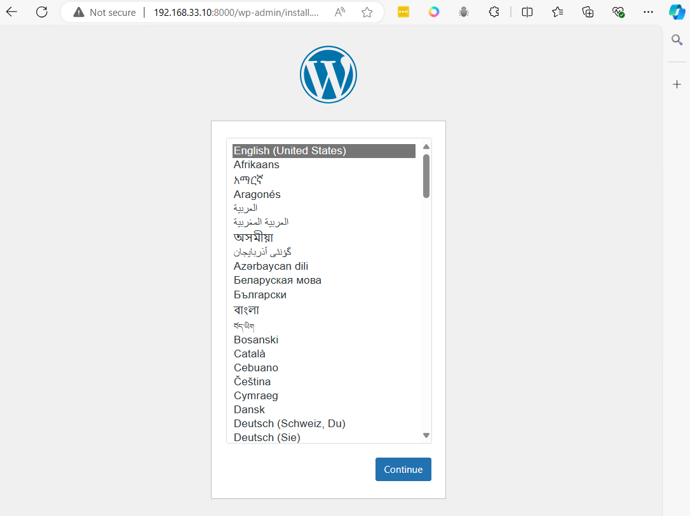

# Wordpress Container

```
cd ~
mkdir wordpress
cd wordpress
```

Copy to terminial
create  docker-compose.yml
```
cat <<EOF | tee docker-compose.yml
services:
  db:
    image: mysql
    volumes:
      - db_data:/var/lib/mysql
    restart: always
    environment:
      MYSQL_ROOT_PASSWORD: rootpassword
      MYSQL_DATABASE: wordpress
      MYSQL_USER: wordpress
      MYSQL_PASSWORD: wordpress

  wordpress:
    depends_on:
      - db
    image: wordpress:latest
    ports:
      - "8000:80"
    restart: always
    environment:
      WORDPRESS_DB_HOST: db:3306
      WORDPRESS_DB_USER: wordpress
      WORDPRESS_DB_PASSWORD: wordpress
      WORDPRESS_DB_NAME: wordpress
volumes:
  db_data:
EOF
```

```
cat docker-compose.yml
```

```
docker compose up -d
```



```
docker compose stop
```

```
docker compose down
```