# Wordpress & Pod deployment


## 1. Create a Pod  
First, create a new Pod to house both the WordPress and MariaDB containers.
```
$ podman pod create --name wordpress-pod -p 8080:80
af245546816ea8d82dea5254f40db9455bd6841321f58a9377390d40a7a9e192
```

## 2. Deploy the MariaDB Container Inside the Pod

Run the MariaDB container inside the newly created Pod. This container will store WordPress data in the database.
```
podman run -d \
    --pod wordpress-pod \
    --name mariadb \
    -e MYSQL_ROOT_PASSWORD=rootpassword \
    -e MYSQL_DATABASE=wordpress \
    -e MYSQL_USER=wpuser \
    -e MYSQL_PASSWORD=wppassword \
    -v mariadb_data:/var/lib/mysql \
    mariadb:10.5
```

Here:

- The --pod wordpress-pod flag ensures that the MariaDB container is attached to the Pod.
- The container is running with environment variables to configure the database.
- A volume mariadb_data is used to persist MariaDB data.

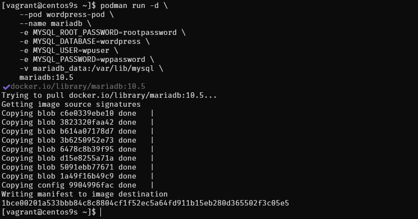

##  3. Deploy the WordPress Container Inside the Pod

```
podman run -d \
    --pod wordpress-pod \
    --name wordpress \
    -e WORDPRESS_DB_HOST=127.0.0.1 \
    -e WORDPRESS_DB_NAME=wordpress \
    -e WORDPRESS_DB_USER=wpuser \
    -e WORDPRESS_DB_PASSWORD=wppassword \
    -v wordpress_data:/var/www/html \
    wordpress:latest
```

Here:

- The --pod wordpress-pod flag attaches the WordPress container to the same Pod.
- The WORDPRESS_DB_HOST=127.0.0.1 variable points to the local MariaDB instance inside the Pod (as both containers share the same network namespace).
- The WordPress content is persisted with the volume wordpress_data.

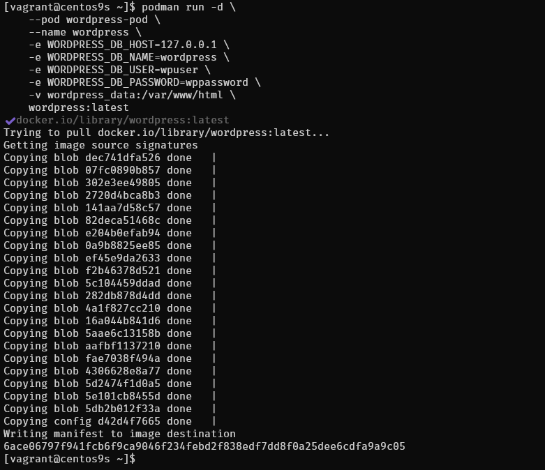

## 4. Verify the Pod and Containers
To check if both containers are running in the Pod, you can use the following command:

```
$ podman ps --pod
```

This should show the Pod wordpress-pod and both containers (mariadb and wordpress) running inside it.

## 5. Access WordPress  http://<your_server_ip>:8080
Open your web browser and navigate to http://192.168.30.10:8080. You should see the WordPress installation page, where you can complete the setup.

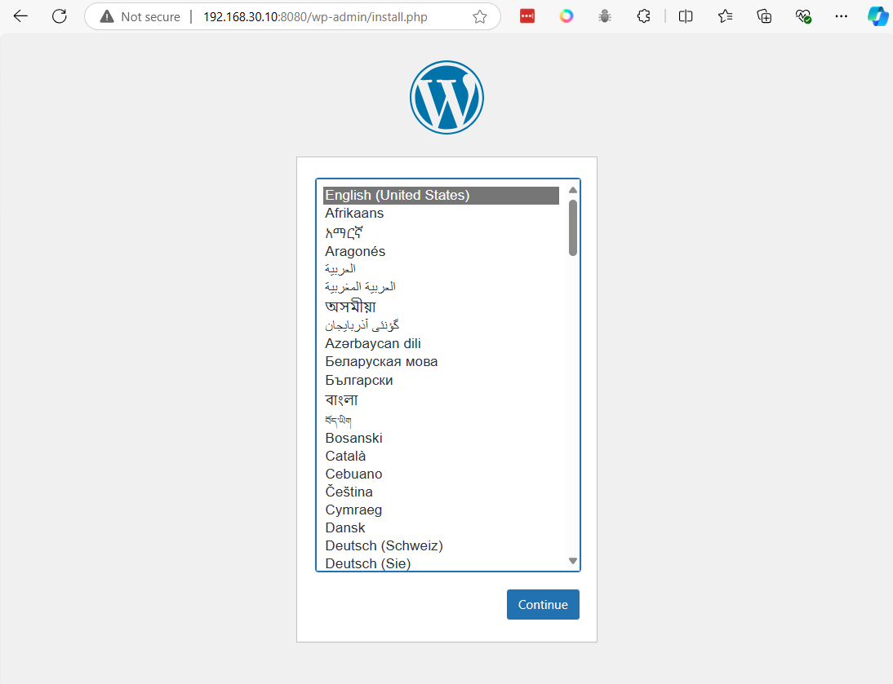

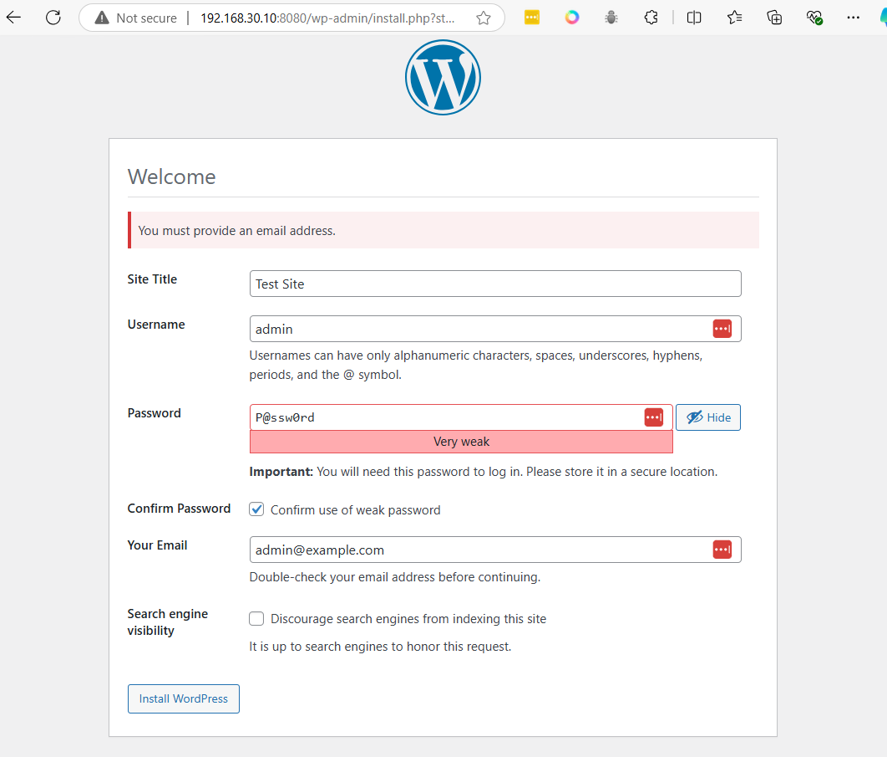
- Press install

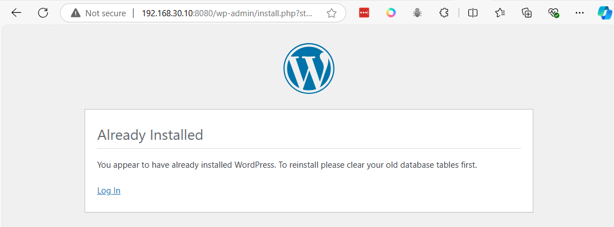
login

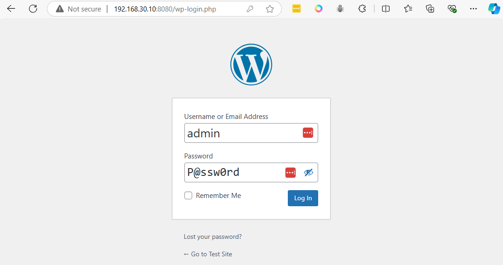

## 6. Use Ngrok to access
- create Accout https://ngrok.com/ 
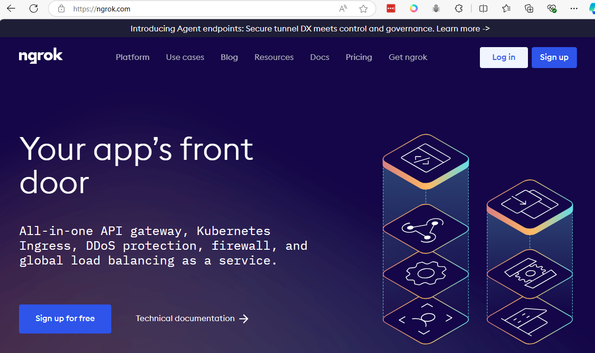
Login
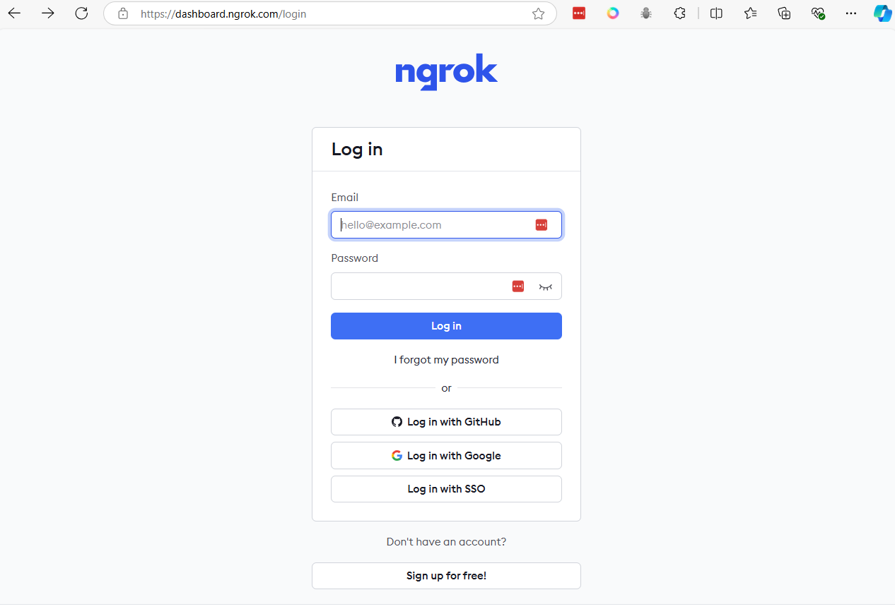
- Open Dashboard ngrok (https://dashboard.ngrok.com/) 
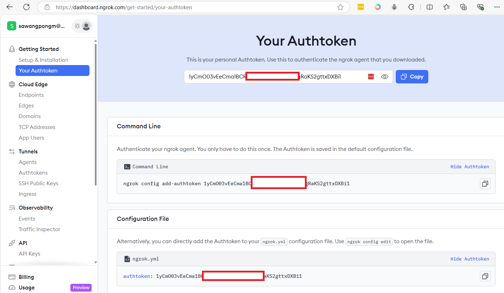
- Get token, copy it

- Download ngrok to vm
```
wget https://bin.equinox.io/c/bNyj1mQVY4c/ngrok-v3-stable-linux-amd64.tgz
sudo tar xvzf ./ngrok-v3-stable-linux-amd64.tgz -C /usr/local/bin
```

- ngrok authtoken NGROK_AUTHTOKEN
```
ngrok config add-authtoken 1yCmO03vEeCma1BCRaxxxxxxxxxxxxjs5NgRaKS2gttxDXBi1
```
- change to you token

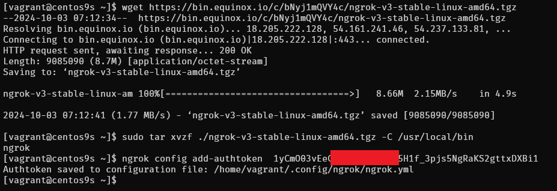

## Create tunnel to app

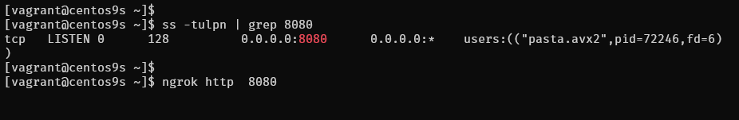

Enter

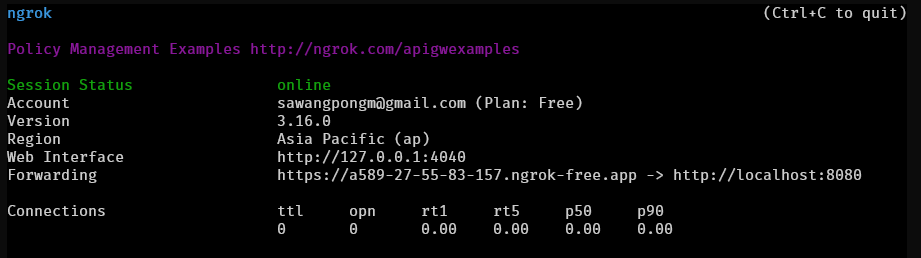

copy  https://a589-27-55-83-157.ngrok-free.app 


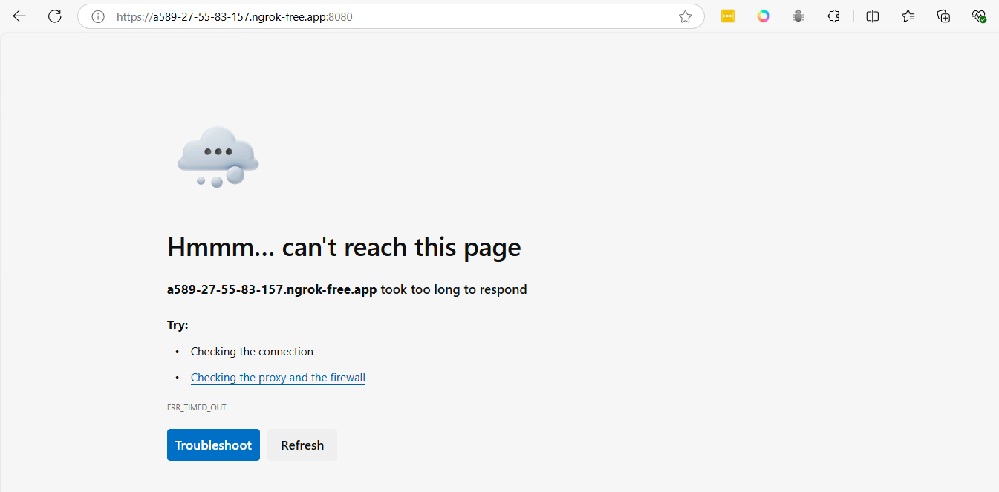


```

```
## 7. Managing the Pod

- Stop pod
```
podman pod stop wordpress-pod
```

- Start the Pod
```
podman pod start wordpress-pod
```

- Remove
```
podman pod rm -f wordpress-pod
```