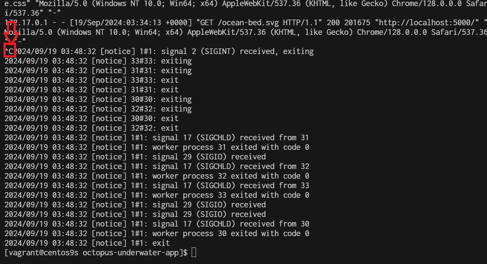

# Workshop1 kubernetes

Step1 Start minikube start 
```
$ minikube version
$ minikube start 
```

Step2 Cluster pods
see all the pods running in the minikube cluster using the command
```
$ kubectl get pods -A
```

Step3 Cluster Version
```
$ kubectl version --client -o json
```

Step4 list manage
```
$ minikube image ls --format table
```


**Step5 Build Docker image**
```
$ sudo dnf install git -y
$ git clone https://github.com/OctopusSamples/octopus-underwater-app.git
$ cd octopus-underwater-app
$ docker build . -t underwater
```


```
$ docker images
REPOSITORY                    TAG       IMAGE ID       CREATED          SIZE
underwater                    latest    779034591bf4   39 seconds ago   43.6MB
gcr.io/k8s-minikube/kicbase   v0.0.45   aeed0e1d4642   2 weeks ago      1.28GB
```


**Step6 Finally, run the Docker image with the command:**

```
$ docker run -rm -p 5000:80 underwater
```


**Step7 Test by open other windows terminal**
create ssh forwardport
```
C:\Users\sysadmin\Vagrantdev\minikube>ssh -L 5000:localhost:5000 vagrant@192.168.40.10
vagrant@192.168.40.10's password: 
Last login: Thu Sep 19 03:31:32 2024 from 192.168.40.10
```


The command you've provided is used to set up SSH port forwarding. Here’s what it does:

- **ssh:** This is the SSH command to log in to a remote machine.
- **-L 5000:localhost:5000:** This sets up local port forwarding. It forwards port 5000 on your local machine to port 5000 on the remote machine (in this case, localhost refers to the remote machine).
- **vagrant@192.168.40.10:** This specifies the user (vagrant) and the remote host's IP address (192.168.40.10) that you're connecting to.
Once this command is executed, you can access services running on port 5000 of the remote machine through port 5000 of your local machine. For example, if the remote machine is running a web application on port 5000, you can access it locally by opening http://localhost:5000 in your browser.

**Step8 Test from browser after ssh reverse**


Ctrl+C to stop running container. then container will be remove with option ```--rm```



**Step9 Push image to minikube**
Pushing local images to minikube is a straightforward process with the command:
```
$ minikube image load underwater
```


Step19 create deployment yaml
```
cd ~
mkdir deployment
cd deployment
```

```
cat <<EOF | tee underwater.yaml
apiVersion: apps/v1
kind: Deployment
metadata:
  name: underwater
  labels:
    app: web
spec:
  selector:
    matchLabels:
      app: web
  replicas: 1
  strategy:
    type: RollingUpdate
  template:
    metadata:
      labels:
        app: web
    spec:
      containers:
        - name: underwater
          image: underwater
          imagePullPolicy: Never
          ports:
            - containerPort: 80
EOF
```

**Then deploy the app with the command:**
```
$ kubectl apply -f underwater.yaml
```


**check pod**

