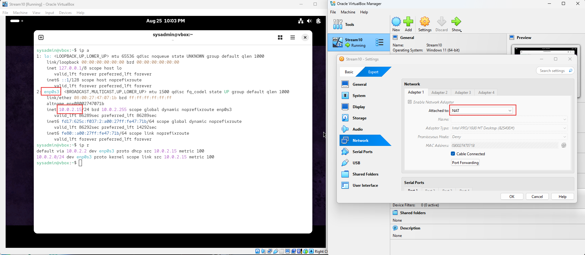
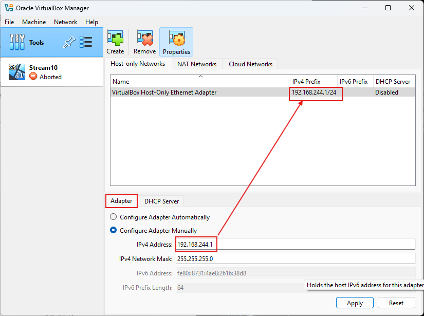
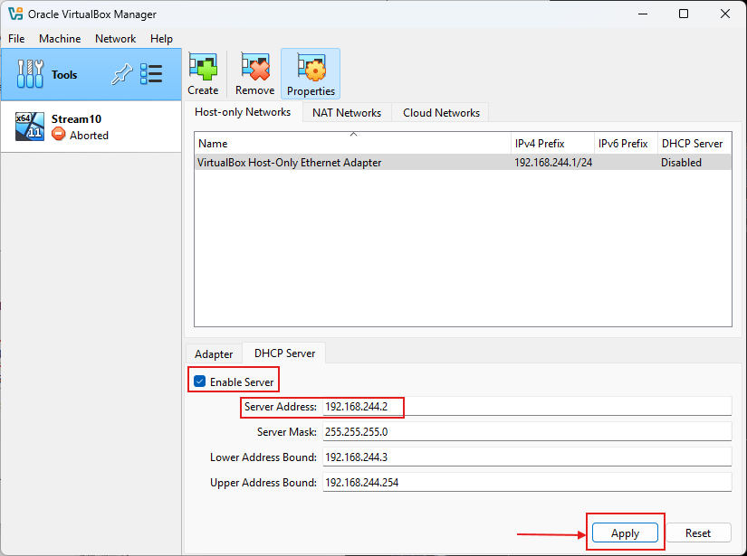
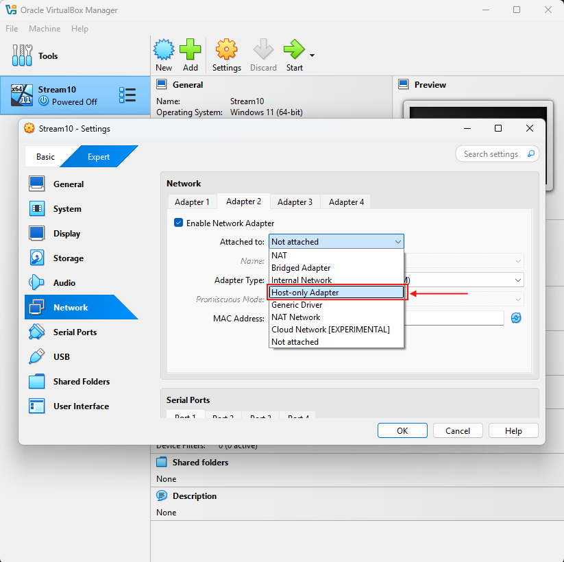
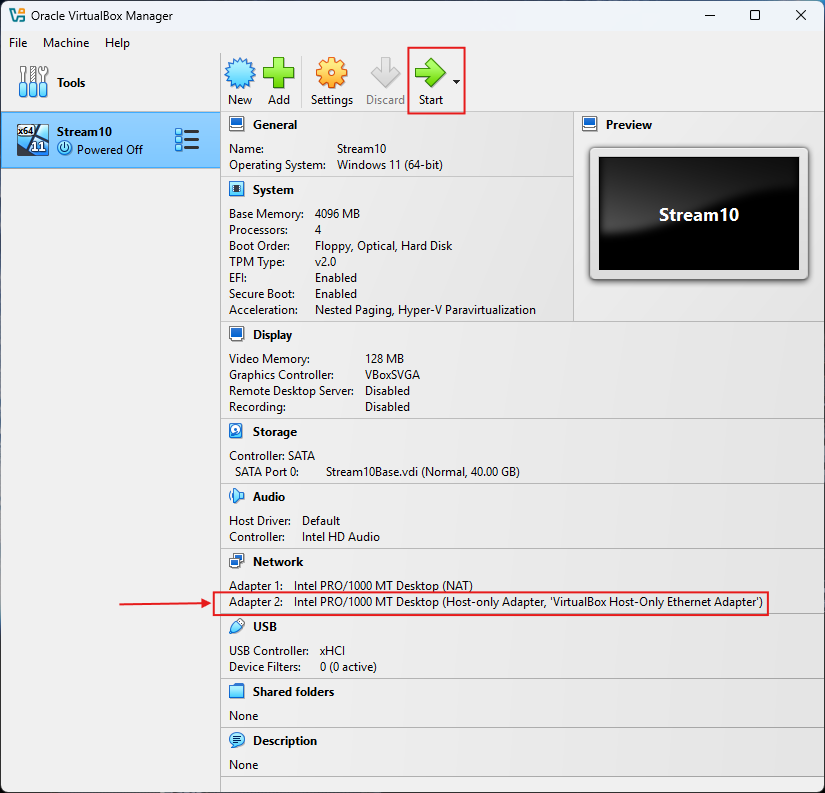
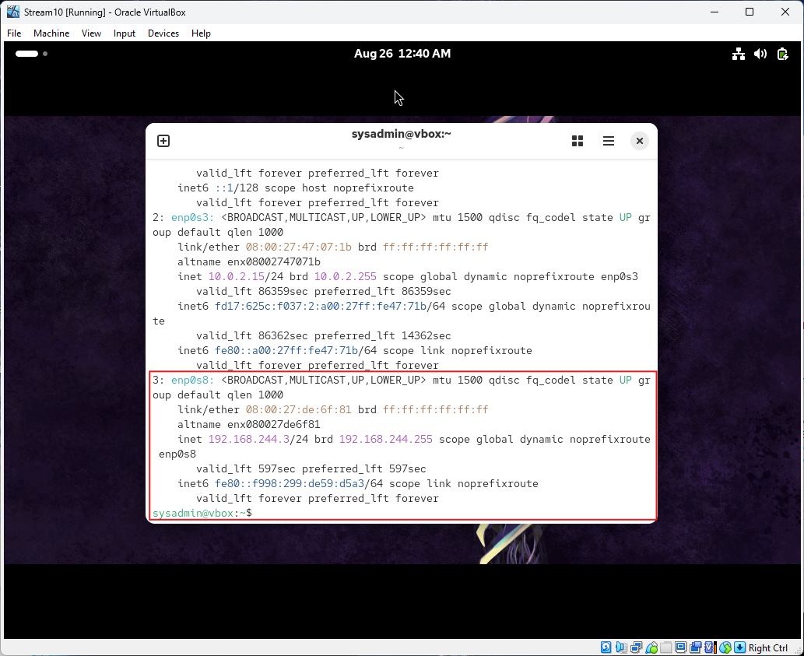
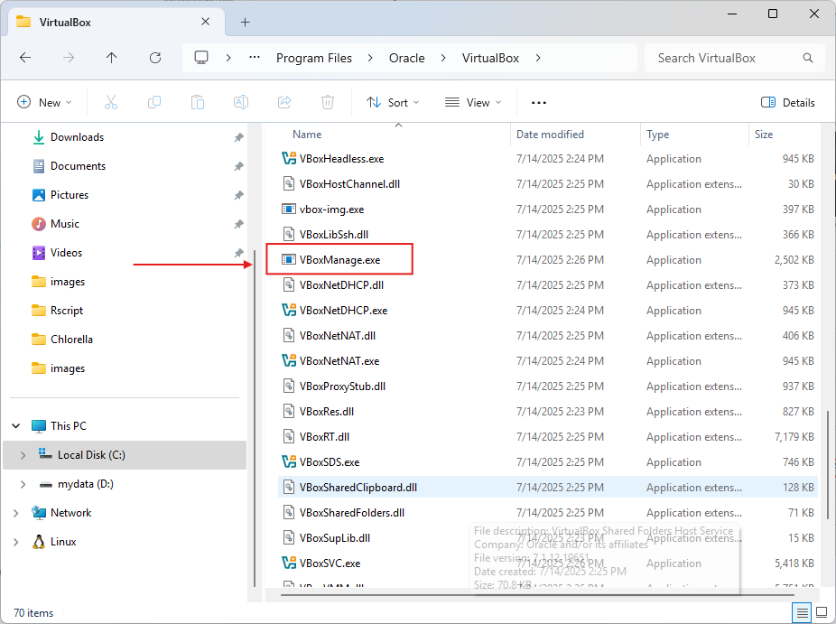
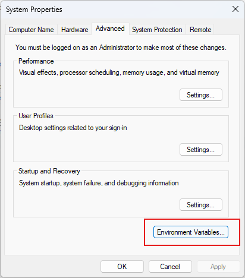
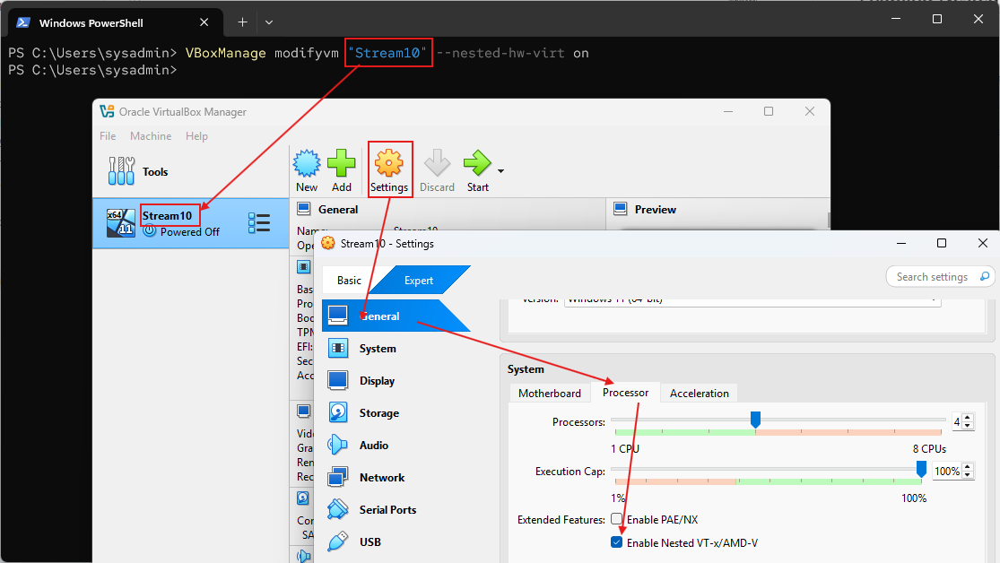
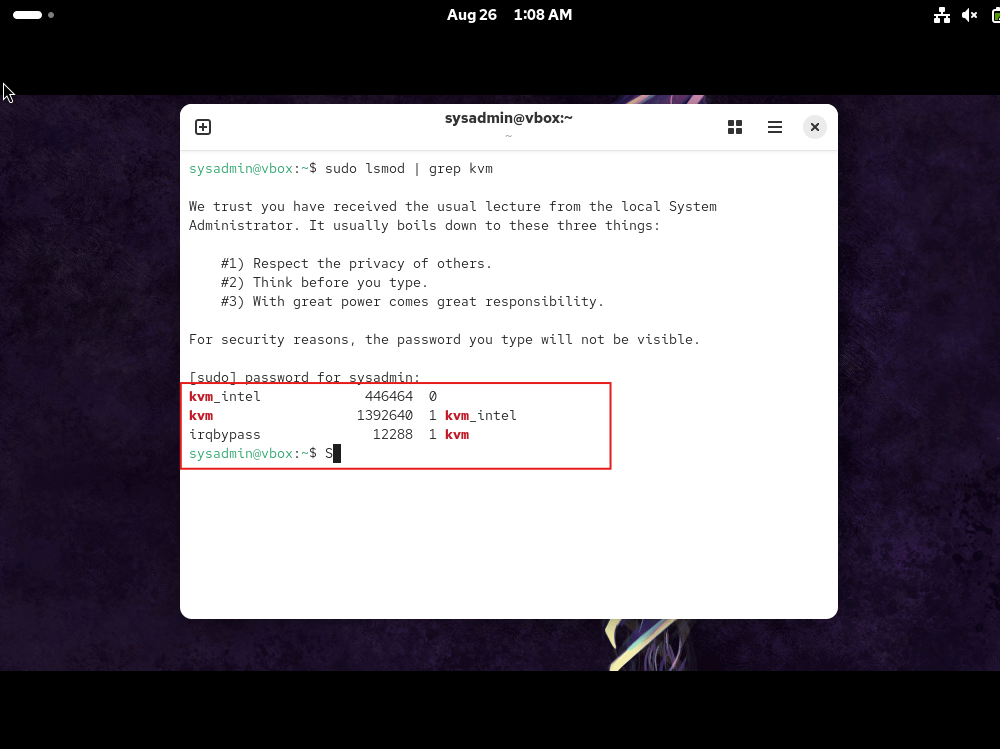

# Virtualization


## 1. Types of Hypervisor

- **VirtualBox (Type 2 Hypervisor):**   
  Often called a "hosted" hypervisor. It is an application that runs on top of a conventional host operating system (like Windows, macOS, or Linux). The host OS manages the hardware resources, and VirtualBox requests those resources from the host OS to provide to the guest VMs. This adds a layer of abstraction, which can slightly impact performance.

Architecture: Application -> Host OS -> Hardware

- **KVM (Type 1 Hypervisor):** 
  Often called a "bare-metal" hypervisor. It is effectively a kernel module that converts the Linux kernel itself into a hypervisor. It runs directly on the host's hardware to control it and manage guest operating systems. This direct access typically results in better performance and efficiency.

    Architecture: Hypervisor (Linux Kernel) -> Hardware

## 2. Network Modes

- **Bridged Networking:** The VM connects directly to the physical network, appearing as a separate device alongside the host. It gets an IP from the same DHCP server as the host.

- **Host-Only Networking:** Creates a private network between the host and VMs, with no connection to the external network.

## 3. Test a new web application on an isolated network. 

How would you configure two VirtualBox VMs to communicate with each other but have no connection to the host or external internet?

The correct networking mode to achieve this is Internal Network.

- For VM1 and VM2, open their Settings -> Network.
- Attach the network adapter to Internal Network.
- Give the network a name (e.g., my-test-net). This name is case-sensitive and must be identical for both VMs.

**Host-Only** networking would not be correct for complete isolation, as it creates a private network that still includes the host OS.

## NAT Interface


- First network interface is NAT interface
- NAT interface is Routing to Outer traffic
- Can't SSH to ip's NAT interface
- Use Port Forward to access to service inside VM

## SSH to VM
- Let's Stop VM 
- add host only network 192.168.244.1/24

- check DHCP server 192.168.244.2



- Then add Adapter2 as Host-only network. it's second interface
- Start VM again
  




- Next step  open windows terminal  ssh to vm
```
ssh root@192.168.244.3
```

## Enabling Nested VT-x/AMD-v in Virtualbox
- Stop VM first
- Navigate to Virtual box Directory (Windows) ``C:\Program Files\Oracle\VirtualBox``
  

- add path ``C:\Program Files\Oracle\VirtualBox`` to windows env
  

- Click ``Environment Variable``


on Windows Terminal Run:
```
VBoxManage modifyvm "YourVMName" --nested-hw-virt on
```
- Replace YourVMname with you name , Example
```
VBoxManage modifyvm "stream10" --nested-hw-virt on
```


- Click General >  Processor > VT-x  enable

Check:


- Open VM again and Run ``lsmod | grep kvm``  to verify kernel module
```
sudo lsmod | grep kvm
```



!!! note
    Lorem ipsum dolor sit amet, consectetur adipiscing elit. Nulla et euismod
    nulla. Curabitur feugiat, tortor non consequat finibus, justo purus auctor
    massa, nec semper lorem quam in massa.