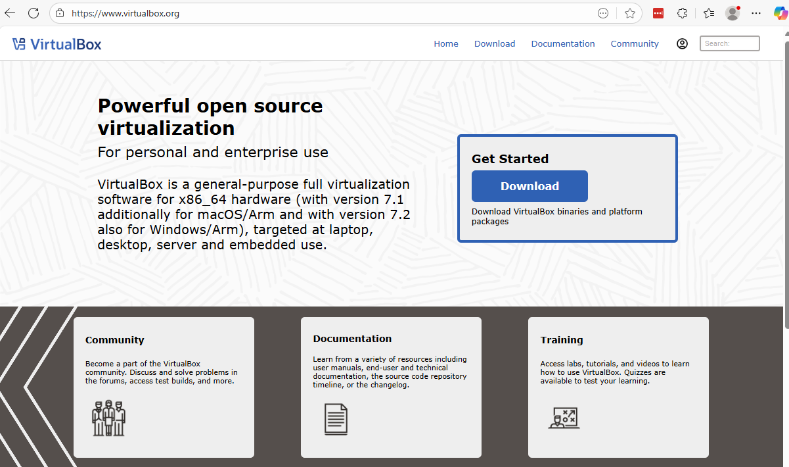
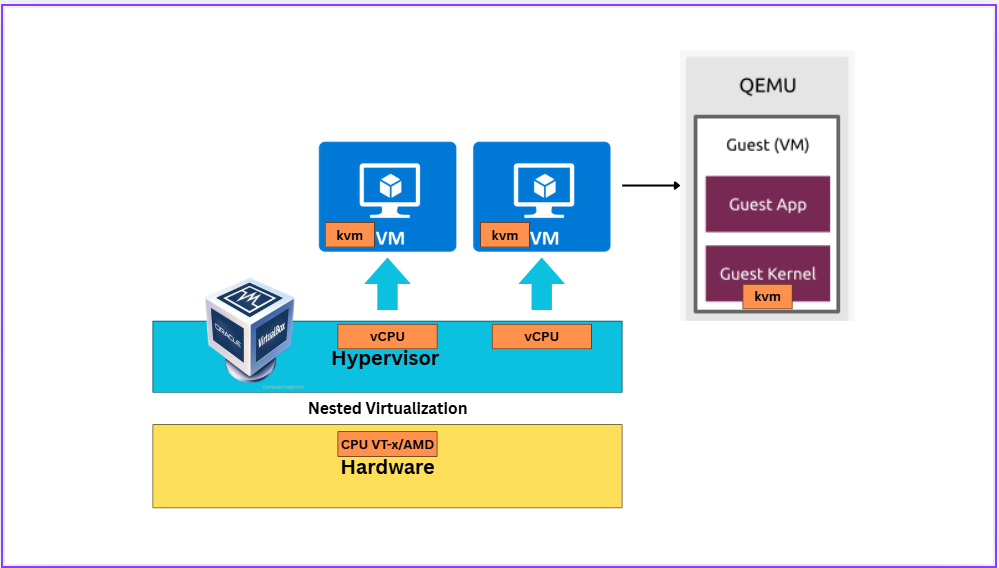
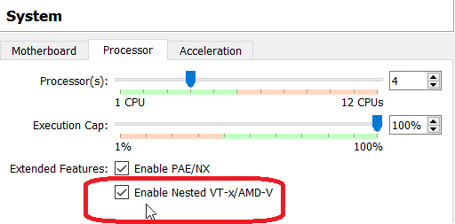
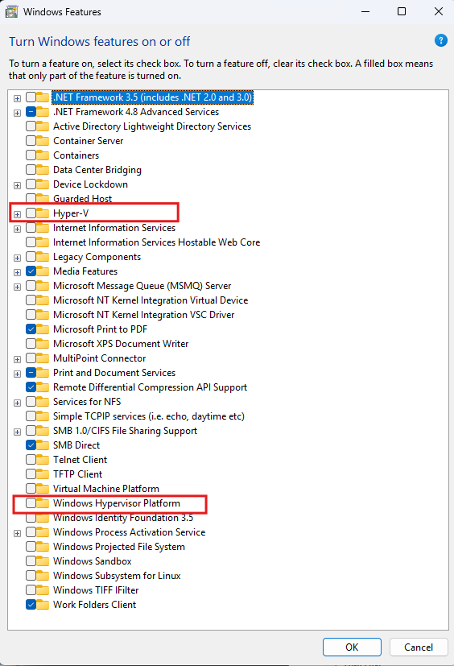
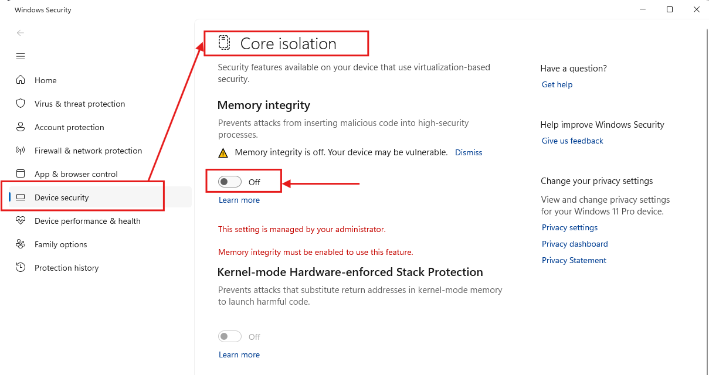

# Linux Modern Infrastructure
## KVM & Container Technologies on CentOS Stream 9 & Stream 10

## Course Overview
This comprehensive course covers modern infrastructure technologies including Kernel-based Virtual Machine (KVM) virtualization and container technologies (Docker, Podman) on CentOS 9.

### Prerequisites
- Basic Linux command line knowledge
- CentOS Stream 9/10 installed system
- sudo/root privileges

**Virtualbox**  
[https://www.virtualbox.org/](https://www.virtualbox.org/)




**update system**
```
sudo dnf update -y
sudo dnf upgrade -y

sudo dnf install -y epel-release
sudo dnf install -y vim wget curl net-tools bind-utils tree htop
```

**Verify kvm kernel module**
```
lsmod | grep kvm
```
if not show 

## Workshop



## Enable Nested hypervisor from Windows


- Run Virtualbox on Windows terminal to tell virtualbox (VboxManage command) enable nested hypervisor
```
$ VBoxManage modifyvm <VirtualMachineName> --nested-hw-virt on
```

## Remove Hyper-V
- Disable Hyper-V from CLI
```
bcdedit /set hypervisorlaunchtype off
DISM /Online /Disable-Feature:Microsoft-Hyper-V
```

## Disable Hyper-v from ``Windows Feature``
- Open menu   and Disable options from image belows
  


## Turn off Core Isolate
- Open meniu 

